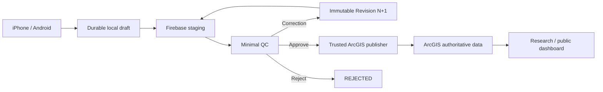
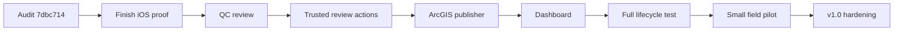

# PA Watershed Watch

Native watershed field collection, private Firebase staging, focused human QC, authoritative ArcGIS publication, and research/public visualization.

> **Current path:** finish the remaining iOS verification, audit the pushed mobile checkpoint, then move directly through **QC → ArcGIS → dashboard**.

## Project status

| Area | Status |
| --- | --- |
| Phase 1–10 scientific/backend foundation | ✅ Stable |
| Android native Spark lifecycle | ✅ Live verified |
| iOS native production integration | 🟡 Integrated; final live offline/correction proof pending |
| Mobile production checkpoint | ✅ `codex/mobile-production-integration-v1` @ `7dbc714` |
| Firebase Auth + Firestore staging | ✅ Active Spark path |
| Automated validation engine | ✅ Implemented/tested baseline; deployed trigger deferred |
| Cloud photo/audio | ⏸ Deferred from current release path |
| Minimal reviewer/QC | ▶️ Next |
| ArcGIS publishing | ▶️ Next |
| Dashboard connection | ▶️ Next |
| End-to-end pilot | 🧭 After vertical integration |

The historical `mobile/` Expo/React Native tree remains engineering reference only. The approved apps are native SwiftUI on iOS and native Jetpack Compose on Android.

## End-to-end architecture



ArcGIS Workflow Manager Online is optional. The project must remain able to complete human review without waiting on that license.

## Current mobile handoff

```text
codex/mobile-production-integration-v1
└── 7dbc714  stable-ID Firestore sync preflight
    └── 5fe0e3e  native + backend CI gates
        └── 995dc6b  production mobile integration
```

Android has passed the real authenticated Spark lifecycle including session restoration, server site catalog, GPS, durable draft restart, offline submit/restart, exactly-one synchronization, server acknowledgement, recent/detail, correction flow, and account isolation.

iOS production wiring is present. Real authentication, restored session, and server site-catalog checks passed before the Codex usage limit interrupted the remaining live verification. Resume from the existing working tree; do not restart the implementation.

## Spark-compatible scope

The current project remains on Firebase Spark.

**Required:** Auth, Firestore staging, durable local storage, offline synchronization, stable identities, correction revisions, QC, ArcGIS publishing, and dashboard integration.

**Deferred:** Firebase Storage/cloud media, Blaze billing, and the deployed Firebase Cloud Functions validation trigger.

QC and ArcGIS publication are not deferred by this decision. Trusted review/publishing logic can live in the web/server layer.

## Next execution path



See **[`docs/NEXT_MOVES.md`](docs/NEXT_MOVES.md)** for the executable plan.

## Product surfaces

| Surface | Data source | Purpose |
| --- | --- | --- |
| Collector mobile | native local store + Firebase staging | drafts, submissions, corrections |
| Minimal reviewer interface | Firebase staging through trusted actions | approve / request correction / reject |
| Research/public dashboard | approved ArcGIS data | maps, trends, analysis |

The research/public dashboard must not treat raw Firebase staging records as authoritative data.

## Native apps

**iOS — SwiftUI:** `Phone App/iPhone App/PAWatershedWatch`

**Android — Jetpack Compose:** `Phone App/Android App`

<p align="center">
  
  
  
</p>

## Scientific rules

- Preserve original submitted science.
- Corrections create immutable new revisions.
- Keep local transport state separate from scientific workflow state.
- Reuse stable identities across retries so network failure does not create duplicate observations.
- Record meaningful workflow transitions with actor, time, state change, and reason.
- Version app/schema/validation contracts.
- Flag unusual observations for review rather than silently discarding them.
- Publish only approved records that are successfully verified in ArcGIS.

## Documentation

- [`docs/NEXT_MOVES.md`](docs/NEXT_MOVES.md) — immediate execution plan
- [`docs/PROJECT_STATUS.md`](docs/PROJECT_STATUS.md) — current operational status
- [`docs/PROJECT_ROADMAP.md`](docs/PROJECT_ROADMAP.md) — phases through v1.0
- [`docs/ARCHITECTURE.md`](docs/ARCHITECTURE.md) — system ownership and boundaries
- [`docs/SYSTEM_FLOW_AND_FAILURES.md`](docs/SYSTEM_FLOW_AND_FAILURES.md) — happy path and failure handling
- [`docs/REVIEW_AND_PUBLISHING_STRATEGY.md`](docs/REVIEW_AND_PUBLISHING_STRATEGY.md) — QC and ArcGIS strategy
- [`docs/DEVELOPMENT_WORKFLOW.md`](docs/DEVELOPMENT_WORKFLOW.md) — branches and checkpoint workflow

## Keep v1 focused

Do not add chat, AI scientific conclusions, automatic rejection of anomalous data, direct mobile → ArcGIS writes, public dashboard → Firebase staging reads, broad background location, social features, elaborate field analytics, or Bluetooth instrument integrations before the core lifecycle is proven.

## v1 acceptance gate

**collect offline → survive restart → sync exactly once → request correction → create immutable Revision 2 → approve → publish exactly once to ArcGIS → dashboard displays only the approved record.**
