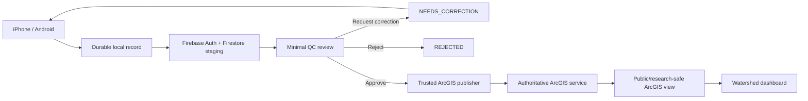
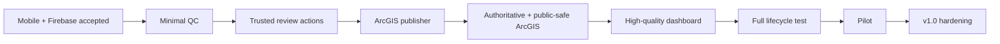

# PA Watershed Watch

A production-oriented watershed data platform for native field collection, focused human QC, authoritative ArcGIS publication, and scientifically careful research/public visualization.

> **Current phase:** the mobile/Firebase core is accepted. Build the minimal QC → ArcGIS → dashboard vertical path next.

## Current status

| Area | Status | Source of truth |
| --- | --- | --- |
| Phase 1–10 platform foundation | ✅ Stable baseline | `main` @ `794e55c8` |
| Native iPhone collector | ✅ Accepted upstream | SwiftUI + Firebase/SwiftData |
| Native Android collector | ✅ Accepted upstream / live verified | Jetpack Compose + Firebase/Room |
| Mobile production checkpoint | ✅ Audited | `codex/mobile-production-integration-v1` @ `7dbc714` |
| Firebase Auth + Firestore staging | ✅ Working contract | `central-pa-watershed-dev` |
| Minimal reviewer/QC workflow | ▶️ Active next phase | trusted web layer |
| ArcGIS private staging schema | ✅ Existing | Phase 7 hosted service + verification scripts |
| Authoritative ArcGIS publisher | ▶️ Next vertical connection | approved revisions only |
| Research/public dashboard | ▶️ Required next quality surface | public-safe approved ArcGIS views only |

The historical `mobile/` Expo/React Native implementation remains **engineering reference only**. The approved collector product is native SwiftUI on iOS and native Jetpack Compose on Android.

## Vertical product flow



ArcGIS Workflow Manager Online is **optional**, not a release dependency. The Watershed platform owns the scientific record/revision semantics; a future Workflow Manager adapter may be added only if it provides real value.

## What is already real in the native collector

The independent audit of `7dbc714` found real production data-layer behavior rather than mock state:

- Firebase Email/Password Authentication and session restoration;
- server-backed authenticated `siteCatalog` reads + offline cache;
- Room on Android and SwiftData on iOS;
- owner-scoped durable drafts/submissions;
- stable submission/event/revision/measurement identities;
- real GPS capture and accuracy;
- canonical supported science codes/units;
- persisted offline submit queue;
- safe Firestore DRAFT → child records → SUBMITTED ordering;
- server-source acknowledgement before local `Synced`;
- retry/idempotency protection;
- immutable submitted revisions;
- `NEEDS_CORRECTION` readback and Revision N+1 correction flow;
- Firestore default-deny security with collector ownership isolation.

See [`docs/MOBILE_INDEPENDENT_AUDIT_7DBC714.md`](docs/MOBILE_INDEPENDENT_AUDIT_7DBC714.md).

## Data ownership

| Layer | Owns |
| --- | --- |
| Native local database | working drafts, durable retry/sync state |
| Firebase Firestore | private/unapproved submissions, immutable revisions, workflow/readback state |
| Trusted QC/web layer | reviewer authorization, review transitions, audit events, publication orchestration |
| Private authoritative ArcGIS | approved/published scientific records + publication identifiers |
| Public/research ArcGIS views | approved, privacy-safe data exposed to visualization |
| Dashboard | map/trends/interpretation UI over ArcGIS-approved data only |

The dashboard must never read raw Firestore staging as authoritative science.

## Minimal QC principle

The expected reviewer population is one or two people, so the reviewer experience stays intentionally small:

```text
/review
/review/{submissionId}

Approve
Request Correction
Reject
```

The review page should make the science easy to inspect: site/map, collection time, measurements and units, method/instrument, GPS accuracy, notes, validation context when available, and immutable revision history.

## Existing ArcGIS foundation

The project does not need a new GIS model from scratch. The repository already contains the hardened ArcGIS schema/configuration, the private Phase 7 ArcGIS Online staging item, fixed layer/table IDs, relationship expectations, time-zone rules, and verification scripts.

The current private Phase 7 hosted item is **not** the final authoritative/public destination. The next publisher phase must deliberately create/designate the authoritative approved-data service and public/research-safe view(s).

## Dashboard quality bar

The dashboard is a primary scientific product surface, not an afterthought. v1 should prioritize:

- a clear site/watershed map;
- site selection and filtering;
- latest approved observation;
- scientifically labeled parameter/unit selection;
- historical time-series trends;
- date-range controls;
- honest missing-data/sampling-density presentation;
- validation/data-quality context without turning it into a water-health grade;
- privacy-safe provenance details;
- responsive and accessible interaction.

Do not imply continuous monitoring from discrete samples, silently interpolate missing data, or expose unapproved/private staging data.

## Three small mobile closeout items

Carry these in parallel; do not reopen the mobile architecture:

1. Hide/disable cloud media in the current Spark build before field use so media cannot break sync.
2. Before QC/publication production readiness, persist original entered value/unit for every supported measurement alongside the canonical normalized value.
3. Before QC/publication production readiness, use trusted server-authored workflow/audit timestamps and keep them distinct from scientific collection time.

## Development path



## Key documentation

- **Independent mobile audit:** [`docs/MOBILE_INDEPENDENT_AUDIT_7DBC714.md`](docs/MOBILE_INDEPENDENT_AUDIT_7DBC714.md)
- **Immediate execution plan:** [`docs/NEXT_MOVES.md`](docs/NEXT_MOVES.md)
- **Current status:** [`docs/PROJECT_STATUS.md`](docs/PROJECT_STATUS.md)
- **Architecture:** [`docs/ARCHITECTURE.md`](docs/ARCHITECTURE.md)
- **Happy path + failure paths:** [`docs/SYSTEM_FLOW_AND_FAILURES.md`](docs/SYSTEM_FLOW_AND_FAILURES.md)
- **Review / publishing strategy:** [`docs/REVIEW_AND_PUBLISHING_STRATEGY.md`](docs/REVIEW_AND_PUBLISHING_STRATEGY.md)
- **Data dictionary:** [`docs/DATA_DICTIONARY.md`](docs/DATA_DICTIONARY.md)
- **ArcGIS Online Phase 7:** [`docs/ARCGIS_ONLINE_STEP7.md`](docs/ARCGIS_ONLINE_STEP7.md)
- **Firebase Phase 9:** [`docs/FIREBASE_STEP9.md`](docs/FIREBASE_STEP9.md)
- **Validation Phase 10:** [`docs/VALIDATION_ENGINE_STEP10.md`](docs/VALIDATION_ENGINE_STEP10.md)

## Definition of progress

The project is optimizing for vertical completion with quality and stable system boundaries:

**collect → sync → inspect → correct → approve → publish → visualize**

Every transition should preserve scientific provenance, be idempotent across system boundaries, provide explicit acknowledgement, and remain simple enough for the actual human user.