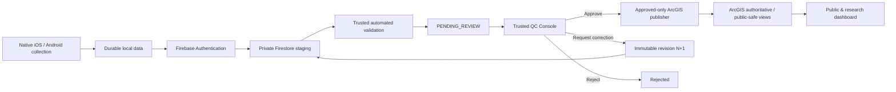

# PA Watershed Watch

Native watershed field collection, Firebase validation and trusted QC, approved ArcGIS publication, and public water-quality visualization.


## Current product flow



Firebase/Firestore is the private pre-publication scientific workflow system. The QC Console is the authoritative human review surface. ArcGIS Workflow Manager is not a release dependency. The retired Expo/React Native client is preserved in Git history, not in the active tree.

## Current state

Status vocabulary: **LIVE** means operating in a connected environment; **VERIFIED** means implemented and covered by current automated verification; **NEXT** is the active release sequence; **DEFERRED** is intentionally excluded.

| Component | Status | Current reality |
| --- | --- | --- |
| Native iOS / SwiftUI | VERIFIED | Shipping architecture; Firebase Auth/Firestore, durable local records, GPS, revisions, App Attest in Release |
| Native Android / Jetpack Compose | VERIFIED | Native collector kept healthy by unit, lint, build and emulator instrumentation CI |
| Firebase Authentication | VERIFIED | Native and QC authentication integration present |
| Firestore private staging | VERIFIED | Security Rules and persistence contracts are emulator-tested |
| Automated validation | VERIFIED / LIVE | Engine, persistence and trigger integration are tested; the development validation trigger is active |
| Trusted QC Console | VERIFIED / GATED | Authenticated reviewer UI and review lifecycle tests are green; the real reviewer identity is provisioned and final live sign-in/review readback remains a human gate |
| ArcGIS private staging | VERIFIED | Existing ArcGIS schema/staging foundation remains; it is not the human QC system |
| Approved-only ArcGIS publisher | VERIFIED / GATED | Private authoritative service and four public-safe read-only views are provisioned and independently verified; live OAuth app credentials and a provenance-cleared non-test record remain external gates |
| Public/research dashboard | VERIFIED / EMPTY | Production adapter reads only the four anonymous public-safe views; the views are intentionally empty until a provenance-cleared approved observation exists |
| iOS TestFlight | VERIFIED / IN BETA | Build 13 (`0.1.0 (13)`) is `VALID` and `IN_BETA_TESTING`; physical-device installation remains to be confirmed |
| Photo/audio/media capture | DEFERRED | Zero scientific attachments in the current production candidate |

## Repository map

- `Phone App/iPhone App/PAWatershedWatch` — native SwiftUI iPhone application.
- `Phone App/Android App` — native Jetpack Compose Android application.
- `web` — authenticated trusted QC Console.
- `functions` — Firebase Cloud Function entry points.
- `firebase` — Firestore/Storage rules and indexes.
- `validation` — trusted validation engine, orchestration and persistence.
- `config` — scientific/workflow contracts and catalogs.
- `tests` — contract, rules, validation and review lifecycle tests.
- `scripts` — controlled environment/bootstrap utilities.
- `docs` — current authoritative technical documentation.

## Scientific principles

- Submitted scientific revisions are immutable.
- Entered value and entered unit provenance are preserved alongside canonical values.
- Validation, workflow, review and publication state are server-owned.
- An unusual measurement is not automatically invalid science.
- Human approval is required before publication.
- Corrections create a new immutable revision rather than mutating old submitted science.
- Private collector/reviewer fields must never enter public ArcGIS views.
- Water Temperature is the only currently confirmed mandatory science measurement for the first release.
- Media capture/upload is deliberately deferred.

## Current development target

Close the Phase 11/12 pre-release gates: verify Build 13 on the physical iPhone, complete real-reviewer sign-in/readback, provision item-scoped ArcGIS OAuth credentials, then run the first provenance-cleared non-test approval → publication → public-view → dashboard readback. The approved-only publisher and public dashboard are already implemented, tested and deliberately gated until those human/external checks are complete.

## Developing

Backend/contracts:

```bash
npm ci
npm run test:contracts
```

QC Console:

```bash
cd web
npm ci
npm run typecheck
npm run build
```

Android and iOS are verified in `.github/workflows/mobile-ci.yml`; platform-specific setup is documented beside each native project. Do not commit credentials, private keys, local build state, DerivedData, Gradle outputs or App Store Connect keys.

## Documentation

Start with [`docs/README.md`](docs/README.md). Architecture, roadmap, scientific contracts, QC operations and deferred-feature decisions are indexed there.