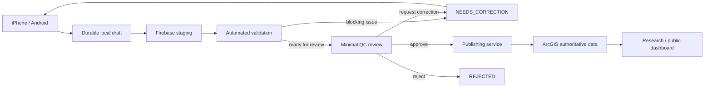
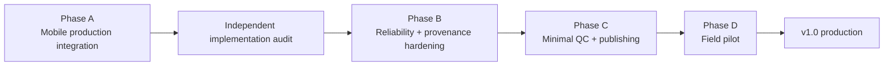

# PA Watershed Watch

A production-oriented watershed data platform for native field collection, automated validation, focused human QC, authoritative ArcGIS publication, and research/public dashboards.

> **Current priority:** finish the native iOS + Android production integration before adding new product features.

## Current status

| Area | Status | Source of truth |
| --- | --- | --- |
| Phases 1–10 platform foundation | ✅ Complete / locked baseline | `main` @ `794e55c8` |
| Approved iPhone UX | ✅ Complete frontend | `Phone App/iPhone App/PAWatershedWatch` |
| Approved Android UX | ✅ Complete frontend | `Phone App/Android App` |
| Native production integration | 🚧 In progress | `codex/mobile-production-integration-v1` |
| Automated validation engine | ✅ Implemented + tested | `validation/` + Phase 10 tests |
| Minimal reviewer/QC workflow | 🧭 Next | Firebase-backed review page |
| ArcGIS publishing service | 🧭 Next | server-side only |
| Research/public dashboard | 🧭 Later | approved ArcGIS data only |

The historical `mobile/` Expo/React Native implementation remains in the repository as **engineering reference only**. The approved product direction is native SwiftUI on iOS and native Jetpack Compose on Android.

## System flow

ArcGIS Workflow Manager Online is **optional**, not a release dependency. If Penn State licensing becomes available later, it can be added as a workflow adapter without becoming the database of truth.

## Product surfaces

| Surface | Reads/writes | Purpose |
| --- | --- | --- |
| Collector mobile | local database + Firebase staging | own drafts, submissions, corrections |
| Minimal reviewer page | Firebase staging | validation review, approve/correct/reject |
| Research/public dashboard | ArcGIS approved data | maps, trends, exports, analytics |

The public dashboard must never use raw Firebase staging submissions as authoritative data.

## Native mobile apps

### iOS — SwiftUI

`Phone App/iPhone App/PAWatershedWatch`

Approved design and workflow source for the native product. Production integration is being added underneath the existing UI without redesigning it.

### Android — Jetpack Compose

`Phone App/Android App`

Native Android counterpart preserving the same product semantics with Android-native interaction behavior.

### Approved iOS design previews

  
  
  

## Data ownership

- **Local native stores:** durable collector drafts, media queue, retry/sync state.
- **Firebase:** private/unapproved staging submissions, immutable revisions, validation/readback state, reviewer workflow state.
- **Trusted backend:** validation, audit, reviewer actions, publication transitions, ArcGIS writes.
- **ArcGIS:** authoritative approved sites and observations after verified publication.
- **GitHub:** code, contracts, schemas, tests, documentation, history, issues, and releases — never live environmental data.

## Non-negotiable scientific rules

- Preserve the original field submission.
- Corrections create a new immutable revision; they do not overwrite submitted science.
- Keep transport state separate from scientific/workflow state.
- Use stable identities and idempotent retries so failures cannot create duplicate observations.
- Record who changed what, when, and why.
- Version application, schema, and validation contracts.
- Flag unusual measurements and spatial anomalies for review rather than silently discarding them.
- Treat quality/confidence scores as data-quality signals, not water-health grades.
- Publish only records that were approved and successfully verified in ArcGIS.
- Never expose private access/landowner information through collector-safe or public data paths.

## Development path

The current detailed roadmap is in **[`docs/PROJECT_ROADMAP.md`](docs/PROJECT_ROADMAP.md)**.

## Key documentation

- **Current roadmap:** [`docs/PROJECT_ROADMAP.md`](docs/PROJECT_ROADMAP.md)
- **Architecture:** [`docs/ARCHITECTURE.md`](docs/ARCHITECTURE.md)
- **Happy path + failure paths:** [`docs/SYSTEM_FLOW_AND_FAILURES.md`](docs/SYSTEM_FLOW_AND_FAILURES.md)
- **Review / publishing strategy:** [`docs/REVIEW_AND_PUBLISHING_STRATEGY.md`](docs/REVIEW_AND_PUBLISHING_STRATEGY.md)
- **Project status:** [`docs/PROJECT_STATUS.md`](docs/PROJECT_STATUS.md)
- **Development / branch workflow:** [`docs/DEVELOPMENT_WORKFLOW.md`](docs/DEVELOPMENT_WORKFLOW.md)
- **Data dictionary:** [`docs/DATA_DICTIONARY.md`](docs/DATA_DICTIONARY.md)
- **Firebase Phase 9:** [`docs/FIREBASE_STEP9.md`](docs/FIREBASE_STEP9.md)
- **Validation Phase 10:** [`docs/VALIDATION_ENGINE_STEP10.md`](docs/VALIDATION_ENGINE_STEP10.md)
- **Android implementation audit:** [`docs/ANDROID_PORT_AUDIT.md`](docs/ANDROID_PORT_AUDIT.md)

## Intentionally out of scope for now

Keep the field product focused. Do not add chat, AI-generated scientific conclusions, automatic rejection of anomalous data, direct mobile → ArcGIS writes, public dashboard → Firebase staging reads, broad background location tracking, social/community features, elaborate field analytics, or Bluetooth instrument integration before the core pipeline is proven.

## Release philosophy

The release candidate is not considered ready because screens render or unit tests pass. It must prove the complete scientific lifecycle under failure:

**collect offline → preserve draft through restart → sync exactly once → validate → request correction → create immutable Revision 2 → approve → publish exactly once to ArcGIS → dashboard reads the approved record.**
