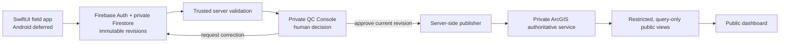
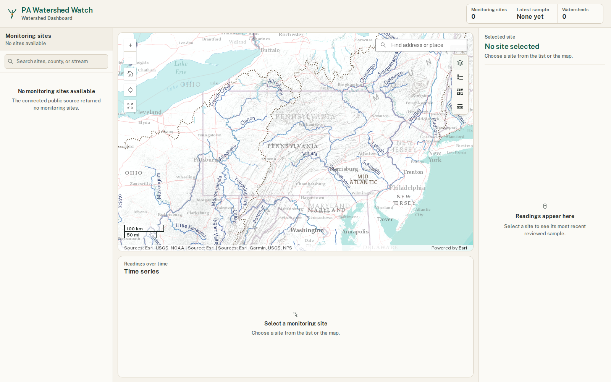

# PA Watershed Watch

Native field collection and a controlled path from private scientific records to public water-quality views. PA Watershed Watch combines a SwiftUI iPhone app, Firebase validation, a private reviewer console, server-side ArcGIS publication, and a read-only public dashboard. The Android app is retained in the repository; its product and release work is deferred until after the iOS submission and publication milestone.

**Release status, 2026-09-28 12:22 UTC:** PR #42 tested source [`b9580c9`](https://github.com/UnbrokenMango21/watershed-water-quality-dashboard/commit/b9580c91fb1e8da7f529e5e14ab5eb2cd7ab7ee7) merged into integration as [`1da94e0`](https://github.com/UnbrokenMango21/watershed-water-quality-dashboard/commit/1da94e04b8a15a99aacd41210f78c8c6bd2288b3); PR #34's 16 checks passed there. PR #44 merged at [`8ef5684`](https://github.com/UnbrokenMango21/watershed-water-quality-dashboard/commit/8ef568421f9d74ce7ef6aeb73244742bfebb3522) after five checks passed on reviewed head `8d1c4f5`. At integration `8ef5684`, 11/15 checks passed; PR #34's iOS-native and Swift CodeQL jobs remained in progress, CodeQL was neutral, and the GitHub Advanced Security AI scan failed before analysis because its requested model was unsupported. **Live Firebase readiness for the iPhone test: NO.** The release remains provisional pending combined CI and live readiness evidence. App Store Connect had no 1.0.0 (17) upload or processed build in the 11:42 UTC query; physical-device, reviewer, ArcGIS credential, and non-test publication proof remain open. See [metric evidence and limits](docs/PROJECT_METRICS.md).

## How a reading becomes public

```mermaid
flowchart LR
  A[SwiftUI field app<br/>Android deferred] --> B[Firebase Auth + private Firestore<br/>immutable revisions]
  B --> C[Trusted server validation]
  C --> D[Private QC Console<br/>human decision]
  D -->|approve current revision| E[Server-side publisher]
  D -->|request correction| B
  E --> F[Private ArcGIS authoritative service]
  F --> G[Restricted, query-only public views]
  G --> H[Public dashboard]
```

Collection and review stay private. Collector clients cannot write validation, review, audit, or publication state. An approved revision is eligible for publication; approval alone does not mean ArcGIS accepted it. The dashboard reads only anonymous, public-safe ArcGIS views, never private Firestore records. The [architecture](docs/ARCHITECTURE.md) and [publication contract](docs/PHASE12_ARCGIS_PUBLICATION.md) describe the trust boundaries in detail.

## Scientific integrity

- Submitted revisions remain immutable. A correction creates a new revision and preserves the earlier one.
- Entered values and units are retained alongside canonical values. [The production measurement catalog](config/production_measurement_catalog.json) defines current supported measurements and units; Water Temperature is the only confirmed mandatory science measurement.
- Unusual values can prompt review without being silently changed or automatically declared invalid science.
- Public views exclude identities, workflow IDs, private site labels, reviewer notes, credentials, and internal diagnostics. The schema verifier fails closed on unexpected fields or edit capabilities.
- Controlled test observations and historical data with unresolved provenance are excluded from public scientific proof. Demo data is explicitly labeled and is never a production fallback.

## Fall 2026 Engineering Program

**15 weeks × 20 planned hours per week = a 300-hour planning target.** It is not a completed-hours claim. The [authoritative week-by-week plan](project-control/SEMESTER_WORK_LOG.md) separates work evidence from verified time; its hours are not certified by Git activity or CI duration.

| Weeks | Planned focus | Evidence status at 2026-09-28 |
| --- | --- | --- |
| 1–2 · Aug 24–Sep 6 | Reconcile the semester start and earlier native/backend work against dated records. | **Reconciliation open.** The plan does not certify these hours. |
| 3–4 · Sep 7–20 | ArcGIS/public views, dashboard, Build 13, system audit and native verification. | **Work evidenced** in Git and Actions; release gates remain open. Hours are not certified by those artifacts. |
| 5–6 · Sep 21–Oct 4 | Finalization and release controls, then physical iPhone and real-reviewer proof. | **Current closure.** Week 5 activity is documented; Week 6 device and reviewer proof is pending. |
| 7–10 · Oct 5–Nov 1 | Firebase reliability, dashboard interaction, ArcGIS scope/privacy checks and non-test publication readback. | **Planned.** No completion is claimed from the calendar. |
| 11–15 · Nov 2–Dec 6 | Usability, regression, privacy review, submission evidence and final presentation. | **Planned.** Android release work remains deferred until after the iOS submission/publication milestone. |

## Screen evidence

These are [PR #42 dashboard visual QA](https://github.com/UnbrokenMango21/watershed-water-quality-dashboard/actions/runs/36384062900) captures at tested source `b9580c9`, now merged into integration as `1da94e0`; they are not evidence of a live scientific publication. Demo screens contain labeled sample sites and readings. Empty screens use mocked empty public-view responses to verify the interface. The earlier [Build 13 sign-in capture](docs/images/mobile/build-13-sign-in.png) is archival and is not presented as the current iOS release candidate.

| Labeled demo | Empty public-view state |
| --- | --- |
|  |  |
| [Phone time series, demo data](docs/images/portfolio/dashboard-demo-phone-data.png) | [Phone empty site list](docs/images/portfolio/dashboard-empty-phone-sites.png) |

## Explore the repository

| Area | Purpose |
| --- | --- |
| [`Phone App/iPhone App/PAWatershedWatch`](Phone%20App/iPhone%20App/PAWatershedWatch) | Native SwiftUI field app |
| [`Phone App/Android App`](Phone%20App/Android%20App) | Native Jetpack Compose app, deferred for this release cycle |
| [`firebase`](firebase), [`validation`](validation), [`functions`](functions) | Private rules, validation and trusted triggers |
| [`web`](web) | Authenticated QC Console |
| [`publication`](publication) | Approved-only ArcGIS publisher |
| [`public-dashboard`](public-dashboard) | Anonymous public-view reader and responsive dashboard |
| [`config`](config), [`tests`](tests) | Versioned contracts and verification |

Start with the [documentation index](docs/README.md), [current roadmap](docs/ROADMAP.md), [metric ledger](docs/PROJECT_METRICS.md), [portfolio summary](docs/PORTFOLIO_SUMMARY.md), [iOS 1.0 release checklist](docs/IOS_1.0_RELEASE_CHECKLIST.md), and [draft release notes](docs/IOS_1.0_RELEASE_NOTES.md). The [Fall 2026 weekly plan](project-control/SEMESTER_WORK_LOG.md) defines 300 hours as a planning target, not completed time.
