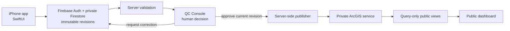
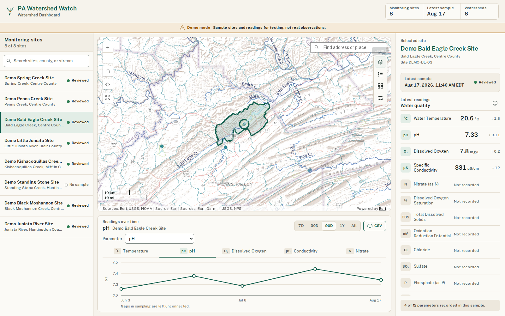
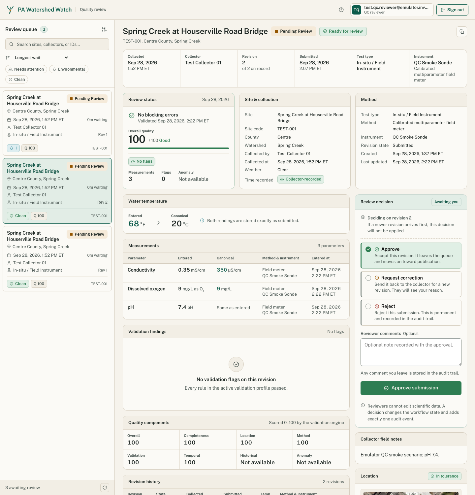
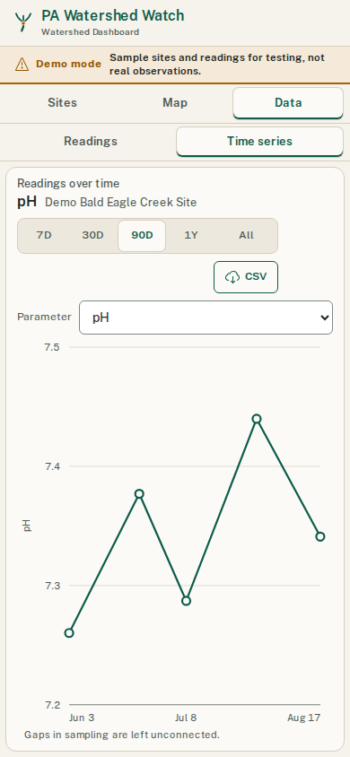
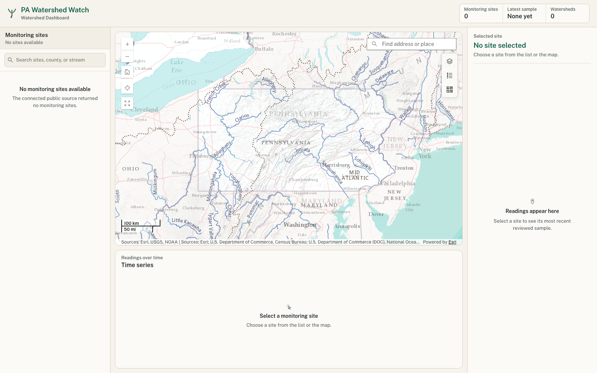

# PA Watershed Watch


**Field water-quality readings, from a phone at the stream to a public map, with a human scientific review in between.**

PA Watershed Watch is a monitoring system built for a Penn State watershed research program in Central Pennsylvania. Field collectors record readings such as water temperature, pH and dissolved oxygen in a native iPhone app. Every submission is validated on the server and reviewed by a person before anything can reach the public. Approved readings are published through ArcGIS to a public dashboard that never sees collector identities, reviewer notes or private workflow data.

It exists because field data is only useful to researchers and the public if its history can be trusted: who collected it, what was originally entered, what changed and who approved it.

I designed and built the system end to end: the SwiftUI app, the Firebase security rules and validation functions, the reviewer console, the ArcGIS publication path, the public dashboard, and the CI and release tooling around them.

## Status

| Surface | State |
| --- | --- |
| iPhone app | **1.0.0 (17)** in TestFlight internal testing, built from tag [`ios-1.0.0-b17`](https://github.com/UnbrokenMango21/watershed-water-quality-dashboard/tree/ios-1.0.0-b17). Physical-device acceptance is in progress. |
| Firebase backend | Security rules and the validation and profile functions are deployed to the development project. |
| QC Console | Deployed to the development environment for authorized reviewers. |
| Public dashboard | [Development deployment](https://public-dashboard-dev--central-pa-watershed-dev.us-central1.hosted.app/). It is empty on purpose: no observation has completed human review and publication yet. |
| ArcGIS | Four anonymous, query-only public views are live and currently hold no records. The publisher stays switched off until the first authorized publication. |
| Android app | Kept in the repository; release work is deferred until after the iOS milestone. |

Nothing here is a scientific result yet. Test observations are kept private and are never published.

## How a reading becomes public


```mermaid
flowchart LR
  A[iPhone app<br/>SwiftUI] --> B[Firebase Auth + private Firestore<br/>immutable revisions]
  B --> C[Server validation]
  C --> D[QC Console<br/>human decision]
  D -->|request correction| B
  D -->|approve current revision| E[Server-side publisher]
  E --> F[Private ArcGIS service]
  F --> G[Query-only public views]
  G --> H[Public dashboard]
```

1. A collector records a visit in the app: site, GPS fix, method, instrument and measurements. Drafts are stored on the device and survive app restarts.
2. Submitting freezes that revision. The collector can never change it again or write validation, review or publication fields; Firestore security rules enforce this.
3. A Cloud Function validates the revision against versioned rules, attaches findings and moves it to review.
4. A reviewer approves, requests a correction with a reason, or rejects it. A correction creates revision 2 and keeps revision 1 intact. Stale decisions on an old revision are refused.
5. Only the current approved revision is eligible to publish. The dashboard reads anonymous ArcGIS views whose schema is checked field by field and fails closed on anything unexpected.

The [architecture](docs/ARCHITECTURE.md) and [publication contract](docs/PHASE12_ARCGIS_PUBLICATION.md) cover the trust boundaries in detail.

## Screens

| Public dashboard (labeled demo data) | QC Console (emulator test data) |
| --- | --- |
|  |  |
|  |  |

Demo screens use clearly labeled sample sites. The dashboard never falls back to demo data in production.

## Engineering evidence

| Check | Scope |
| --- | --- |
| 30 iOS unit tests and 3 UI workflow tests | Model and product contracts; first run to submission and correction revision, draft persistence across relaunch, large text |
| 45 Firestore and 6 Storage security-rule tests | Role separation, immutable revisions, collector-only fields, active reviewer profiles |
| 47 contract tests, 7 validation, 17 review lifecycle, 8 profile, 1 trigger | Validation rules, stale and competing decisions, audit events, display-name changes |
| 17 publication tests | Approved-only transform, privacy allowlist, idempotent writes |
| Dashboard visual QA | 4 viewports × demo and empty modes, map stability, no overflow, no console errors |
| CodeQL | Swift, Kotlin, JavaScript/TypeScript, Python, Actions |

Every pull request runs these on GitHub Actions. TestFlight builds come from a pinned tag and are refused if the tag has moved.

## Scientific integrity and privacy

- Submitted revisions are immutable; corrections add revisions.
- Entered values and units are stored beside canonical values. Water temperature is the only required measurement; everything else waits for a documented decision from the research supervisor ([open questions](docs/SUPERVISOR_QUESTIONS.md)).
- Validation findings inform the reviewer. They never silently change a reading or declare an environmental condition.
- Public views exclude collector and reviewer identities, notes, private site labels and workflow IDs.
- Secrets, local environment files and raw ArcGIS inventory stay out of Git.

## Stack

SwiftUI and SwiftData · Jetpack Compose (deferred) · Firebase Authentication, Firestore, Cloud Functions (Node 22) and App Hosting · Next.js and React · ArcGIS Maps SDK for JavaScript and ArcGIS Online hosted feature services · GitHub Actions, CodeQL and App Store Connect.

## Run it locally

Requirements: Node 22, Java 21 or newer (Firebase emulators), Xcode for iOS.

```bash
bash scripts/dev.sh doctor       # check the toolchain
npm ci                           # root tools and Firebase emulator suite
bash scripts/dev.sh contracts    # contract, publication and provisioning tests
bash scripts/dev.sh emulators    # security rules, validation, review and profile suites
bash scripts/dev.sh web-checks   # dashboard tests and builds, QC typecheck and build
bash scripts/dev.sh ios-ui       # iOS UI workflow against local emulators
```

All automated identities and data live in the local Firebase emulators. The QC Console and dashboard runbooks are in [`docs/`](docs/README.md).

## Repository map

| Path | Contents |
| --- | --- |
| [`Phone App/iPhone App`](Phone%20App/iPhone%20App/PAWatershedWatch) | SwiftUI field app |
| [`Phone App/Android App`](Phone%20App/Android%20App) | Jetpack Compose app (deferred) |
| [`firebase`](firebase), [`functions`](functions), [`validation`](validation) | Security rules, Cloud Functions, validation engine |
| [`web`](web) | QC Console |
| [`publication`](publication) | Approved-only ArcGIS publisher |
| [`public-dashboard`](public-dashboard) | Public dashboard |
| [`config`](config), [`tests`](tests) | Versioned contracts and test suites |

## Project timeline

This is a Fall 2026 research engineering project. The semester plan budgets 15 weeks at 20 hours per week, a **300-hour planning target**, not a record of completed time; see the [weekly plan](project-control/SEMESTER_WORK_LOG.md). Upcoming work: physical-device and reviewer acceptance, the first authorized non-test publication, then Android. See the [roadmap](docs/ROADMAP.md).

## License

[MIT](LICENSE)
