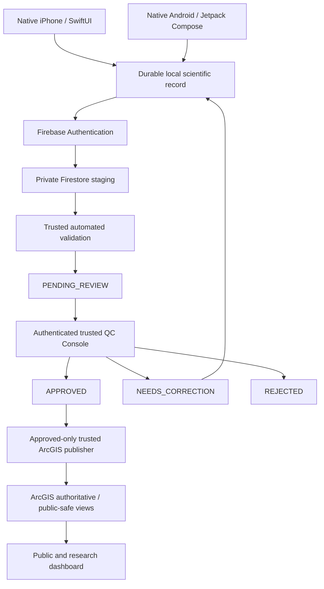

# PA Watershed Watch Architecture

## Authoritative product architecture

Firebase/Firestore is the private pre-publication scientific workflow system. The QC Console is the authoritative human review surface. ArcGIS begins only after trusted approval.

## Trust boundaries

### Collector clients
Native clients may authenticate a collector, maintain durable drafts, acquire location, select catalog data, capture supported scientific measurements and submit a new revision. A collector cannot author trusted validation results, reviewer decisions, audit identities, publication state or public ArcGIS records.

### Trusted backend
Server-owned code validates submitted immutable revisions, persists validation output, advances workflow state according to the contract and enforces reviewer/publication authorization. Security Rules are a hard boundary, not a UI convention.

### Trusted QC Console
Only authenticated reviewer/admin roles may invoke human review actions. The console displays submitted science read-only. Approve, Request Correction and Reject act on the current revision and are guarded against stale revisions and non-idempotent retries.

### Publication boundary
The approved-only ArcGIS publisher is the next engineering phase. It must run server-side, publish only APPROVED immutable revisions, be idempotent by stable event/revision identity, verify ArcGIS readback and never expose mobile ArcGIS credentials.

## Scientific record model

- A submission has stable identity across revisions.
- A submitted revision is immutable.
- A correction produces revision N+1; revision N remains historical evidence.
- Entered values/units are retained as provenance; canonical values are stored rather than silently recomputed by review UI.
- Water Temperature is the only confirmed mandatory science measurement for the first release.
- Unusual/plausibility-warning observations are not automatically invalid.
- Media/photo/audio scientific attachments are intentionally absent from the current candidate.

## Workflow

The expected first-release path is:

`DRAFT → SUBMITTED → validation → PENDING_REVIEW → APPROVED | NEEDS_CORRECTION | REJECTED`

A correction creates a new draft/revision and re-enters submission and validation. Publication is separate from review: APPROVED means eligible to publish, not proof that ArcGIS publication succeeded.

## Retired architecture

The historical Expo/React Native collector is not a shipping application and is removed from the active tree. ArcGIS Workflow Manager Online is not the QC release dependency; it may return later only as an optional adapter if it adds value without weakening the trusted review contract.

## Current release boundary

Phase 11 is locked only after a processed internal TestFlight build completes a real development iPhone → Firebase → validation → QC decision lifecycle, including a correction revision when practical. The resulting evidence belongs in `PHASE11_RELEASE_LOCK.md`; it must not contain credentials.
