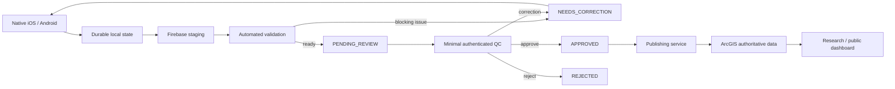
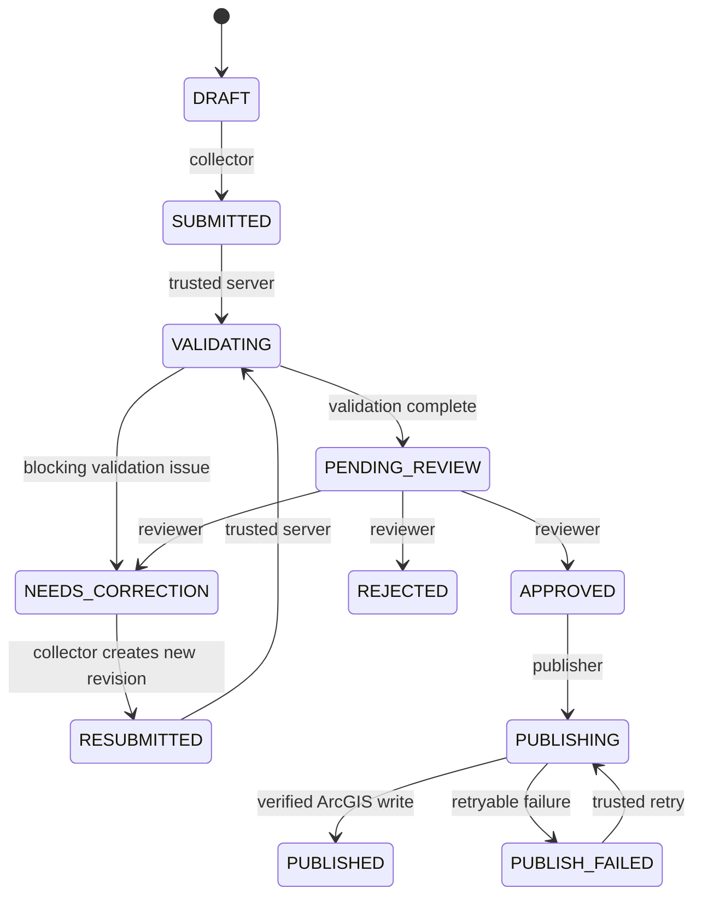

# Platform Architecture

_Last updated: 2026-08-13_

## Architectural objective

PA Watershed Watch is a local-first scientific collection system with private staging, automated validation, focused human QC, verified publication, and a strict separation between unapproved and authoritative data.

The platform is designed so a network failure, app restart, reviewer retry, validation retry, or ArcGIS timeout cannot silently lose science or create duplicate authoritative observations.

## End-to-end flow

ArcGIS Workflow Manager Online may be added later if Penn State licensing makes it useful, but it is not required for the core scientific lifecycle.

## State machine

Transport/synchronization state is separate from this workflow state. A record can be scientifically `SUBMITTED` while the device is still waiting for server acknowledgement, or `NEEDS_CORRECTION` while the device is offline.

## System responsibilities

### Native collector applications

SwiftUI on iOS and Jetpack Compose on Android.

Responsibilities:

- authenticated collector session;
- durable account-scoped local drafts;
- site selection and cached site catalog;
- real GPS capture and accuracy;
- collection timestamp/provenance;
- measurement and unit entry;
- notes and attachments;
- local submission intent;
- idempotent synchronization;
- server acknowledgement/readback;
- correction revision creation;
- privacy-safe diagnostics.

The apps never publish directly to ArcGIS and never own trusted validation/reviewer/publication fields.

### Firebase staging

Firebase is the private pre-publication system of record for:

- collector submission envelopes;
- immutable revision snapshots;
- measurements and attachment metadata;
- validation output/readback;
- workflow status;
- reviewer decisions/context;
- audit events;
- synchronization with collector clients.

Collectors can only read/write data permitted by ownership and workflow rules.

### Validation service

The validation service performs deterministic automated checks such as:

- schema / required-field checks;
- controlled-value checks;
- spatial/site-distance checks;
- measurement/range/plausibility checks;
- duplicate indicators;
- completeness/confidence calculations;
- validation flags and next trusted workflow state.

Unusual environmental values are preserved and flagged rather than silently discarded solely for being unusual.

### Human QC

Preferred implementation for the expected one-or-two reviewer population: a minimal authenticated review page.

Responsibilities:

- pending review queue;
- current revision + prior revision context;
- validation flags / defined quality indicators;
- attachments and map context;
- Approve / Request Correction / Reject.

Reviewer actions must execute through trusted backend transactions that validate role, current state, and current revision before committing a decision and audit event.

### Optional ArcGIS Workflow Manager adapter

Workflow Manager is no longer a hard dependency.

If the ArcGIS Online extension becomes available later, it can provide assignment/orchestration capabilities through an adapter without taking ownership of the scientific staging record or canonical revision history.

### Publishing service

The publishing service consumes approved revisions only.

Responsibilities:

- canonical Firebase → ArcGIS transformation;
- deterministic publication/idempotency key;
- ArcGIS write;
- verification after write;
- recovery from lost responses/timeouts;
- safe retry without duplicate observations;
- persistence of ArcGIS identifiers;
- `PUBLISH_FAILED` recovery.

Mobile and reviewer clients do not contain ArcGIS publishing credentials.

### ArcGIS

ArcGIS contains the authoritative approved sampling sites and published time-stamped observations.

A record is not authoritative merely because it exists in Firebase. Authority begins only after human approval and verified ArcGIS publication.

### Research / public dashboard

Reads approved ArcGIS data only.

Responsibilities may include:

- map exploration;
- latest measurements;
- historical trends;
- site/parameter comparisons;
- defined quality indicators;
- exports;
- research and decision-support views.

The public/research dashboard must never substitute unapproved Firebase staging records when publication is delayed.

### GitHub

GitHub stores source code, schemas, configuration, tests, architecture, audits, roadmap, changelog, issues, pull requests, and releases.

GitHub is not a live environmental measurement database.

## Three data surfaces

| Surface | Canonical source | Visibility |
| --- | --- | --- |
| Collector mobile | local durable store + own Firebase staging records | authenticated collector |
| Reviewer QC | Firebase staging | reviewer/admin |
| Research/public dashboard | ArcGIS approved data | approved audience/public policy |

## Identity and idempotency

The platform keeps separate stable identities for submission, scientific event, immutable revision, measurement, attachment, site, and publication.

Retries reuse existing identities. Network failures never justify creating a replacement scientific record simply to make synchronization easier.

## Non-negotiable provenance rules

- Never silently overwrite the original field submission.
- Corrections create new immutable revisions.
- Every meaningful workflow transition records actor, trusted timestamp, prior state, new state, and context.
- Store schema version, validation-rule version, and application version with scientific submissions.
- Preserve original entered values/units alongside canonical normalized representations where the contract requires them.
- A record becomes authoritative only after supervisor/reviewer approval and confirmed ArcGIS publication.
- Abnormal environmental or spatial observations may be scientifically important and should be flagged, not silently erased.
- Public-safe and collector-safe data paths must exclude private access/landowner information.

## Failure-path design

See [`SYSTEM_FLOW_AND_FAILURES.md`](SYSTEM_FLOW_AND_FAILURES.md) for the node-by-node retry and failure model.

## Roadmap

See [`PROJECT_ROADMAP.md`](PROJECT_ROADMAP.md) for the current implementation order and intentionally deferred features.
