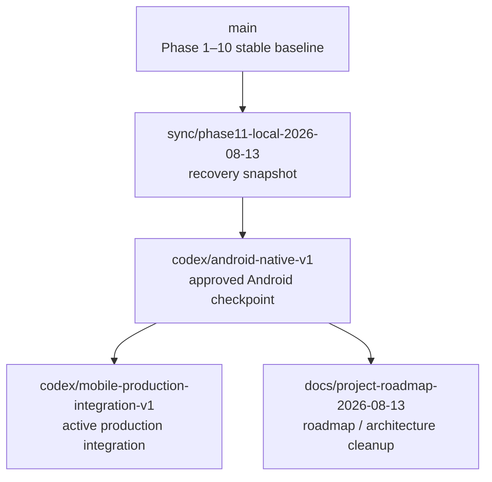
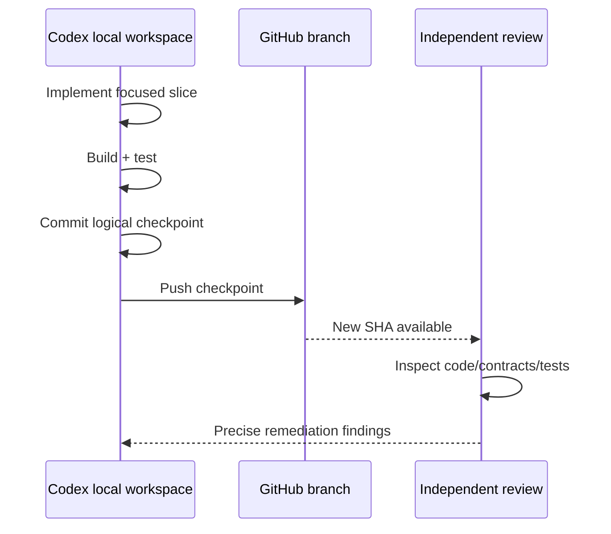

# Development and Branch Workflow

_Last updated: 2026-08-13_

The repository is developed from the same local Git clone used by Codex:

`/Users/parth/Desktop/Watershed Project/watershed-water-quality-dashboard`

GitHub is the durable remote history. Codex should work locally, commit logical green checkpoints, and push those checkpoints to the matching remote branch so independent review can happen continuously.

## Branch roles



### `main`

Protected conceptually as the stable Phase 1–10 platform baseline until the current native integration has passed the required gates.

### `codex/android-native-v1`

Completed native Android frontend checkpoint. Do not continue general production integration here.

### `codex/mobile-production-integration-v1`

Current engineering target for production native iOS + Android integration and backend wiring.

Codex should push only committed logical checkpoints where the relevant tests/builds are green or where a documented BLOCKED external dependency is the only remaining issue.

### `docs/project-roadmap-2026-08-13`

Documentation/coordination branch used to modernize the repository story without colliding with Codex's active implementation files.

### `archive/*`

Historical. Do not revive as current architecture.

## Codex checkpoint workflow



Recommended Codex behavior after the remote branch is configured:

```bash
git fetch origin
git branch --set-upstream-to=origin/codex/mobile-production-integration-v1 codex/mobile-production-integration-v1

# after a logical green checkpoint
git status
git push origin codex/mobile-production-integration-v1
```

Never force-push the active integration branch unless a deliberate recovery decision is made by the project owner.

## Why not auto-push every change?

Automatic push on every edit is intentionally avoided because:

- intermediate work may not compile;
- tests may be temporarily red while a migration is in progress;
- it creates noisy history;
- independent reviewers cannot distinguish stable checkpoints from half-finished implementation;
- broken commits may trigger CI unnecessarily.

The desired automation level is **push automatically or explicitly at green checkpoints**, not continuously after every file save.

## Commit discipline

Prefer focused commits such as:

- `test(contracts): reconcile parameter and workflow contracts`
- `refactor(android): add Room-backed production domain persistence`
- `refactor(ios): add SwiftData production persistence`
- `feat(mobile): connect Firebase authentication and site catalog`
- `feat(mobile): implement idempotent submission synchronization`
- `feat(media): add secure attachment storage lifecycle`
- `feat(backend): trigger validation on submitted revisions`
- `test(mobile): cover offline correction and cross-account isolation`
- `docs(mobile): record production readiness evidence`

Avoid large commits mixing unrelated UI, schema, backend, and documentation changes.

## Review rule

A green test summary is evidence, not proof by itself.

Before merging major integration work, inspect the implementation of:

- persistence schemas/migrations;
- ID generation;
- serialization;
- retry/idempotency;
- auth/ownership;
- Storage paths/rules;
- server timestamps/timezones;
- validation/reviewer/publication transitions;
- immutable revisions;
- cross-platform equivalence.

## Merging the roadmap branch

The roadmap/documentation branch should be rebased or merged into the production-integration branch only after Codex has pushed a safe checkpoint. Resolve documentation changes in favor of the current native architecture; never overwrite newer implementation-generated audits/readiness evidence with stale text.

## Release branch hygiene

Before v1.0:

- remove committed local editor/user-state artifacts where safe;
- exclude local archives and handoff ZIPs;
- verify no service-account/private credentials are tracked;
- ensure native build outputs and local SDK config are ignored;
- require core contract/security/validation gates in CI;
- tag/releases should point to reproducible, reviewed commits.
