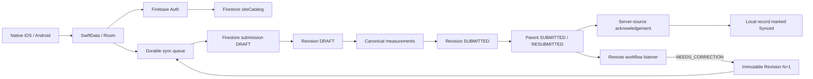

# PA Watershed Watch — Independent Mobile Production Audit

_Audited checkpoint: `codex/mobile-production-integration-v1` @ `7dbc714ca5a92b32ab159d09e8786fcc86f5bbeb`_  
_Audit date: 2026-08-13_

## Verdict

**GO for the next integration phase: minimal QC / trusted web layer.**

The native mobile applications are no longer mock data-layer prototypes. At this checkpoint, both platforms contain real Firebase Authentication, real Firestore site-catalog reads, durable native persistence, account-scoped local records, stable scientific identities, offline submit queues, idempotent Firestore synchronization, server-source acknowledgement, remote workflow readback, and immutable correction revisions.

Android also has reported real-device/emulator evidence for the Spark-backed lifecycle. iOS has equivalent production code and contract tests; the project owner has accepted the remaining iOS live offline/correction proof as non-blocking for moving forward.

The audit does **not** claim the complete product is finished. QC decisions, trusted audit events, authoritative ArcGIS publication, and the production dashboard are the next vertical stages.

## The working data path



## Firebase document ownership

```text
siteCatalog/{siteId}
    authenticated read-only mobile-safe site definitions

submissions/{submissionId}
    workflow envelope / stable event identity

    revisions/{revisionId}
        immutable scientific snapshot after submission

        measurements/{measurementId}
            canonical scientific measurements

        attachments/{attachmentId}
            future/deferred cloud-media metadata

        validationFlags/{flagId}
            trusted validation output; client read-only

    audit/{auditId}
        trusted immutable workflow/audit history; client read-only
```

### Stable identities

The production clients maintain separate identities for:

- `submission_id` — workflow/staging envelope;
- `event_id` — scientific observation/event identity across revisions;
- `revision_id` — immutable scientific snapshot;
- `measurement_id` — deterministic from revision + canonical parameter code;
- `site_id` — sampling-site identity;
- `attachment_id` — attachment identity if media is enabled later.

Retries reuse these identities instead of generating replacement science records.

## What is verified in implementation

### Firebase project and native identity

Both native clients are registered to the development Firebase project `central-pa-watershed-dev` under the locked native identity `org.watershed.pawatershedwatch`.

### Authentication and account isolation

Both apps use Firebase Email/Password Authentication and restore the Firebase session. Local drafts and observations carry the authenticated Firebase UID and repositories query/update records by owner UID. Sync rejects queue items when the current Firebase user does not match the scientific record owner.

Firestore independently enforces ownership. A collector cannot create a submission for another UID, read another collector's submission, inject server-owned fields, approve a record, write validation flags, or write audit records.

### Site catalog

Both native clients query `siteCatalog` from the Firestore server, accept only active mobile-safe sites with valid coordinates, and persist a local cache for field use.

### Durable local-first persistence

Android uses Room with persisted drafts, observations, revisions, measurements, attachments, site cache, and sync queue. Migration tests cover the current schema lineage.

iOS uses SwiftData entities for drafts, observations, revisions, sites, attachments, and sync queue.

Scientific state does not depend on an in-memory screen being alive.

### Canonical science contract

The production measurement catalog explicitly classifies every approved UI measurement as either fully supported or feature-gated.

Fully supported backend codes are:

- `WATER_TEMP_C`
- `PH`
- `DO_MG_L`
- `DO_PERCENT`
- `CONDUCTIVITY_US_CM`
- `TDS_MG_L`
- `ORP_MV`
- `CHLORIDE_MG_L`
- `SULFATE_MG_L`
- `NITRATE_MG_L`
- `PHOSPHATE_MG_L`
- `DISCHARGE_M3_S`

Unsupported UI science cannot silently serialize under an invented backend code.

Temperature preserves the entered value/unit and canonical C/F values. Other supported parameters are converted to the canonical scientific unit before Firestore serialization.

### Firestore write order

Both clients follow the security-compatible remote sequence:

1. preflight stable parent ID;
2. create parent as `DRAFT` if missing;
3. create revision as `DRAFT`;
4. write canonical measurements;
5. verify remote children;
6. finalize revision as `SUBMITTED`;
7. transition parent to `SUBMITTED` or `RESUBMITTED`;
8. fetch the parent from `Source.SERVER` / server source;
9. only then mark the local queue confirmed / record synced.

This is the correct boundary for avoiding false "Synced" states.

### Retry and duplicate protection

Android uses unique WorkManager work keyed by owner UID + submission ID and a persisted queue. Both platforms preflight the server using the stable submission/event/revision identity and confirm an already-acknowledged matching revision rather than recreating it.

This handles retry-after-timeout and double-submit classes of failure without replacing scientific identity.

### Correction loop

Collectors cannot mutate a submitted revision. A correction is allowed only when the parent is `NEEDS_CORRECTION`; the client creates a new `revision_id` and increments the revision number while retaining the same `submission_id` and `event_id`.

Firestore rules independently deny mutation of submitted revisions and measurements.

### Cross-platform parity

Both native implementations are checked against the same golden mobile fixture and the same production parameter catalog/test-type contract. The branch includes regression tests specifically for canonical codes, units, IDs, timezone behavior, and workflow-state consistency.

### Pennsylvania time semantics

Collection/display logic explicitly uses `America/New_York` where product-local time is required. Firestore stores timestamp instants; the downstream ArcGIS contract also defines Eastern Time for product presentation while accepting ArcGIS Online UTC date storage.

## Security posture at this checkpoint

Firestore is default-deny outside explicitly documented paths.

- collectors own only their own staging submissions;
- submitted science becomes immutable to collectors;
- reviewers have read access in the current rule model but cannot directly approve/reject by arbitrary browser writes;
- validation and audit writes are trusted-server only;
- unknown top-level collections are denied;
- App Check providers are wired for native release builds, with enforcement/operational rollout left for production hardening.

This is a good base for the next trusted reviewer service: the QC browser should call narrow server endpoints rather than receive broad write authority.

## Independent findings

### FIX-BEFORE-FIELD-USE — Spark/media mismatch

**Finding:** the production sync implementations still attempt Firebase Storage upload for every photo/audio attachment. The current project decision is to remain on Firebase Spark and cloud media is deferred.

**Impact:** a measurement-only observation can synchronize normally, but a user who adds local media can turn an otherwise valid submission into a retrying/failed sync because Storage is unavailable.

**Required closeout:** feature-gate or hide cloud-media collection in the current Spark build, or explicitly prevent submit with a clear "cloud attachments are not enabled" message. Do not silently discard an attachment the researcher believes is part of the scientific record.

Preserve the attachment interfaces/rules for possible later use.

This item does **not** block development of the QC layer, but it must be resolved before field deployment.

### FIX-BEFORE-QC-PRODUCTION — preserve original entered unit/value for every measurement

**Finding:** native canonical snapshots retain `enteredValue` and entered-unit identity for supported non-temperature measurements, but Firestore measurement documents currently serialize only the normalized `value` and canonical `unit_code`.

**Impact:** the scientific value is correct, but the reviewer cannot always reconstruct exactly what the field researcher typed when an alternate supported unit/basis was selected. This matters for nitrate/phosphate basis conversions, conductivity units, dissolved-oxygen units, and defensible provenance.

**Required closeout:** extend the shared Firestore measurement contract to preserve the original entered value and entered unit/basis alongside the canonical value. Update both native mappers, Firestore rules, golden fixtures, and contract tests together.

Never replace the canonical value; store both entered and normalized representations.

### FIX-BEFORE-QC-PRODUCTION — distinguish field time from trusted workflow time

**Finding:** `collected_at` correctly represents researcher-entered scientific time, but several current `submitted_at` / `updated_at` writes are client-clock timestamps.

**Impact:** a misconfigured phone clock could weaken audit chronology even though the scientific collection time itself remains intact.

**Required closeout:** use Firestore server timestamps for server-receipt/workflow timestamps where practical and keep collection time explicitly separate. Future reviewer/audit/publication timestamps must always be written by the trusted server layer.

### NOT A BLOCKER — final iOS live proof

The remaining iOS offline/restart/correction live-device verification was interrupted externally. Equivalent production code, local persistence tests, golden fixtures, Firebase Auth/site checks, and the Android live path provide enough evidence to proceed under the project owner's explicit acceptance.

Do not reopen the iOS architecture unless the next integration phase exposes a concrete defect.

### NOT VERIFIED BY THIS AUDIT — GitHub-hosted CI execution

The workflow definition includes backend contract/security emulators, Android unit/lint/build/instrumentation, iOS tests/archive, legacy regression guards, and repository hygiene. The audited commit did not expose a GitHub combined status through the available integration, so this audit does not claim those hosted jobs ran successfully at this exact SHA.

Local/Codex test reports and repository test implementations remain evidence, but are not represented here as GitHub-hosted CI proof.

## ArcGIS readiness for the next vertical stages

The repository already contains a real ArcGIS schema and a published private ArcGIS Online QC staging item:

- item ID: `b7775c1bdada4aa8b0787714eca3eb15`
- title: `Central_PA_Watershed_QC_Staging`
- `SamplingSites` service ID `10`
- `SamplingEvents` service ID `20`
- `Measurements` service ID `30`
- `ValidationFlags` service ID `40`
- `AuditEvents` service ID `50`
- WGS 1984 / EPSG:4326
- GlobalID/GUID relationship expectations
- Eastern preferred presentation time with UTC hosted date storage
- verification scripts for the private hosted service

The local ArcGIS Pro environment is also documented as `MyProject.aprx` with `CentralPA_Watershed.gdb`; the `.aprx` binary itself is intentionally not represented here as a GitHub-tracked artifact.

### Important architecture distinction

The Phase 7 hosted item is documented as **private QC staging, not the final authoritative/public service**.

Because Workflow Manager is no longer a release dependency, the next ArcGIS phase must deliberately establish the authoritative approved-data destination and public/research-safe view(s). Do not accidentally publish approved production observations into a layer that is still treated as a temporary QC mirror.

## Ready state before minimal QC implementation

The mobile/Firebase contract is sufficiently stable to build the reviewer layer against these boundaries:

```text
Collector mobile
    writes own DRAFT/SUBMITTED/RESUBMITTED science

Firestore staging
    owns canonical unapproved revisions and workflow envelope

Trusted QC service (next)
    reads submissions/revisions
    verifies reviewer identity
    writes APPROVED / NEEDS_CORRECTION / REJECTED
    appends immutable audit events

Collector mobile
    listens for NEEDS_CORRECTION and creates Revision N+1

Trusted ArcGIS publisher (next)
    consumes APPROVED revision only
    publishes idempotently
    verifies ArcGIS record
    marks PUBLISHED

Dashboard (next)
    reads only approved/published ArcGIS data/public-safe views
```

## Gate to begin QC

**PASS.**

Begin the minimal QC/web layer without another mobile redesign.

Carry the three small mobile closeout items above in parallel, with the media gate required before any field deployment and provenance/server-time hardening required before calling the reviewer/publication chain production-ready.

The next product-quality objective is now vertical completion:

**collect → sync → inspect → correct → approve → publish → visualize**
