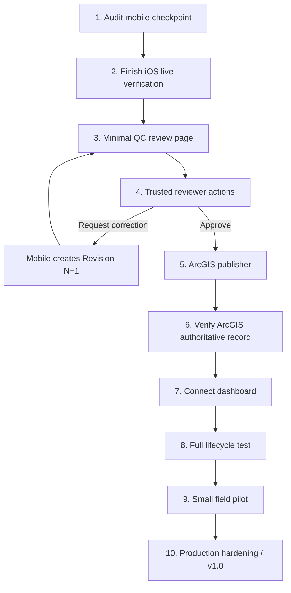
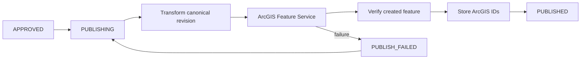

# PA Watershed Watch — Next Moves

_Last updated: 2026-08-13_

This is the execution plan from the current mobile checkpoint to a complete working system. It is intentionally optimized for speed, small scope, and testable handoffs.

## Current starting point

The current pushed mobile checkpoint is:

`codex/mobile-production-integration-v1` @ `7dbc714ca5a92b32ab159d09e8786fcc86f5bbeb`

Android's real Spark-backed happy path is verified. iOS production code is integrated and real Auth/session/site-catalog checks passed, but the final iOS offline/restart/correction live proof was interrupted by the Codex usage limit.

Do not restart the mobile architecture. Resume only the unfinished verification/fixes when Codex capacity returns.

## Fast path to a complete platform



## Move 1 — Independent mobile audit

**Goal:** determine whether `7dbc714` contains any release-blocking defects before building on it.

Audit only the production-critical surfaces:

- local durable persistence on iOS and Android
- account ownership/isolation
- stable `submission_id`, `event_id`, `revision_id`, and measurement IDs
- Firestore mapping parity
- offline submit intent
- process restart recovery
- retry/idempotency behavior
- server acknowledgement before `Synced`
- correction/revision immutability
- Pennsylvania collection-time handling
- unsupported measurement feature gating
- build/release configuration

Do not use this audit as an excuse to redesign the approved UI or add optional features.

## Move 2 — Finish the remaining iOS proof

Resume the existing local working tree when Codex is available again.

Required live sequence:

1. Real Firebase sign-in.
2. Restore authenticated session.
3. Read the real site catalog.
4. Create a draft.
5. Terminate/restart the app; draft survives.
6. Submit while offline.
7. Terminate/restart while still offline.
8. Restore connectivity.
9. Exactly one logical Firestore submission is acknowledged by the server.
10. Record appears in Recent/detail.
11. Account isolation holds.
12. Set a test record to `NEEDS_CORRECTION` using a trusted/admin test path.
13. iOS creates immutable Revision 2 and resubmits without modifying Revision 1.

When green: commit, push, and stop mobile implementation work.

## Move 3 — Minimal QC review page

**Do not build a large custom operations console.** Expected reviewer population is approximately one or two people.

Initial surface:

```text
/review
/review/{submissionId}
/review/history   optional if trivial
```

The queue should show only what helps the reviewer decide:

- site
- collection date/time
- collector
- current revision
- measurements
- method/instrument provenance
- GPS/map context
- notes
- validation information when available
- revision history

Primary actions only:

- Approve
- Request Correction
- Reject

No chat, Kanban board, assignment engine, social features, or enterprise Workflow Manager clone.

## Move 4 — Trusted review actions

The web browser must not have broad authority to rewrite workflow documents directly.

Preferred trusted endpoints:

```text
POST /api/review/approve
POST /api/review/correction
POST /api/review/reject
```

Each action must:

1. verify the authenticated reviewer identity;
2. verify reviewer/admin authorization;
3. load the current submission and current revision;
4. reject stale-state or stale-revision actions;
5. apply only the allowed transition;
6. record a trusted timestamp;
7. record reviewer UID and reason/comment;
8. append an immutable audit event;
9. return the committed server state.

This trusted layer does not need to be Firebase Cloud Functions. The project can remain on Spark while the server-side web layer performs privileged operations using properly protected server credentials/IAM.

## Move 5 — ArcGIS publisher

The publisher is required for v1.

It should consume **approved revisions only**.



Requirements:

- server-side ArcGIS credentials only
- deterministic publication key tied to approved submission/revision
- no direct mobile → ArcGIS writes
- idempotent retry
- protect against “ArcGIS write succeeded but response was lost” duplication
- verify ArcGIS ObjectID/GlobalID or equivalent authoritative identifier
- never undo scientific approval because publication failed

## Move 6 — Connect the dashboard

The dashboard must read **approved ArcGIS data only**.

Do not connect the public/research dashboard to raw Firestore staging.

Minimum useful v1 dashboard:

- sampling-site map
- site selection
- latest approved observation
- measurement summaries
- historical trend by parameter
- date filtering
- quality/validation context where safe and meaningful

Exports and advanced analysis can follow after the core path is proven.

## Move 7 — One complete lifecycle test

Before adding more features, prove this exact chain:

1. Create observation on phone with no signal.
2. Kill/restart the app.
3. Draft survives exactly.
4. Submit offline.
5. Reconnect.
6. Exactly one submission reaches Firestore.
7. Reviewer opens the submission.
8. Reviewer requests a correction.
9. Phone receives `NEEDS_CORRECTION`.
10. Collector creates Revision 2.
11. Revision 1 remains unchanged.
12. Reviewer approves Revision 2.
13. Publisher writes exactly one ArcGIS observation.
14. ArcGIS write is verified.
15. Dashboard displays the approved Revision 2 data.
16. Unapproved/staging data never appears publicly.

If this passes, the system has a legitimate end-to-end scientific lifecycle.

## Move 8 — Pilot

Use TestFlight and Google Play Internal Testing with a small group.

Target: approximately 3–10 researchers, one or two reviewers, and a controlled set of sites.

Deliberately test:

- poor cellular signal
- airplane mode
- app termination
- device restart
- permission denial
- GPS outliers
- repeated Submit taps
- reviewer corrections
- account switching
- app update with saved draft
- ArcGIS publication interruption

## Move 9 — Hardening before v1.0

Only after the complete pipeline works:

- explicit Development / Pilot / Production environments
- app/schema/validation-rule compatibility handling
- site-catalog versioning
- device-clock sanity checks
- deterministic duplicate fingerprint
- privacy-safe diagnostics screen
- operational monitoring
- App Check strategy
- media decision: remove entirely or enable cloud attachments deliberately
- attachment SHA-256/checksums if media remains
- multi-device draft policy

## Explicitly deferred

These are not required to complete the core system:

- Firebase Storage / cloud photo/audio for the current release
- Blaze billing
- deployed Firebase Cloud Functions validation trigger
- chat
- AI scientific conclusions
- automatic rejection of anomalies
- Bluetooth instruments
- broad background location
- social/community features
- elaborate field-app analytics

## Branch plan

Do not create multiple competing authorities.

```text
main
└── stable Phase 1–10 baseline until controlled integration merge

codex/mobile-production-integration-v1
└── current mobile production authority

future recommended implementation branch:
codex/web-qc-publishing-dashboard-v1
└── minimal reviewer + trusted API + ArcGIS publisher + dashboard connection

docs/project-roadmap-2026-08-13
└── roadmap / architecture / coordination
```

The next web branch should begin from the agreed integration base after the mobile audit, not from an unrelated historical dashboard prototype.

## Definition of progress

Prioritize vertical completion over breadth.

A small system that reliably performs:

**collect → sync → correct → approve → publish → visualize**

is more valuable than a larger system with unfinished connections.
