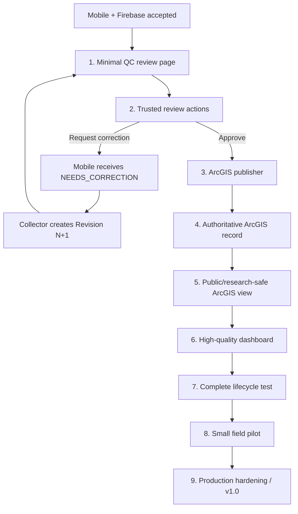
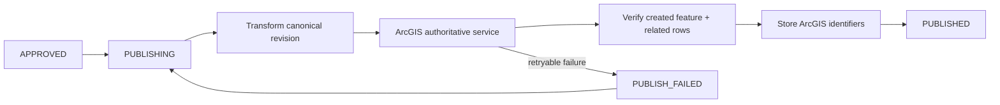

# PA Watershed Watch — Next Moves

_Last updated: 2026-08-13_

This is the execution plan from the accepted mobile/Firebase checkpoint to a complete working scientific system. Optimize for vertical completion, scientific defensibility, usability, and small testable handoffs.

## Starting point — mobile/Firebase accepted

Current mobile authority:

`codex/mobile-production-integration-v1` @ `7dbc714ca5a92b32ab159d09e8786fcc86f5bbeb`

The independent code audit is complete and **passes the project to begin the QC integration phase**. See `MOBILE_INDEPENDENT_AUDIT_7DBC714.md`.

The remaining iOS live proof is explicitly accepted as non-blocking. Do not restart the mobile architecture.

## Fast path to vertical completion



## Parallel mobile closeout lane

Do not delay QC implementation for these, but close them before the stated gate:

- **Before field use:** hide/disable cloud photo/audio in the Spark build so media cannot break submission sync.
- **Before QC/publication production readiness:** persist original entered value + entered unit/basis for every supported measurement alongside the canonical value.
- **Before QC/publication production readiness:** use trusted server-authored workflow/audit timestamps and keep them distinct from researcher collection time.

These are contract-hardening tasks, not another mobile redesign.

## Move 1 — Minimal QC review page

**Primary user:** one or two scientific reviewers, especially the project supervisor. Usability is more important than enterprise-workflow breadth.

Do not build a Workflow Manager clone.

Initial routes:

```text
/review
/review/{submissionId}
/review/history   optional if trivial
```

### Review queue

Show enough information to prioritize work without forcing the reviewer into each record:

- site name;
- collection date/time in Eastern Time;
- collector;
- current revision number;
- workflow state;
- concise measurement summary;
- validation warning/error counts when available;
- correction/resubmission indicator.

### Submission review

The reviewer must be able to inspect the scientific record without hunting through screens:

1. **Identity / provenance** — submission, event, revision, collector, app/schema version.
2. **Site / map** — site, captured GPS, accuracy, distance/context when available.
3. **Collection** — collection time, test type, method, instrument/lab.
4. **Measurements** — original entered value/unit plus canonical normalized value where conversion occurred.
5. **Notes** — field notes exactly as submitted.
6. **Validation** — flags and quality/confidence context when available; unusual science remains reviewable rather than auto-rejected.
7. **Revision history** — prior immutable revisions and correction reasons.

Primary actions only:

- **Approve**
- **Request Correction**
- **Reject**

Correction and rejection require a reviewer reason. Approval may allow an optional note.

No chat, Kanban board, assignment engine, social features, or generic project-management UI.

## Move 2 — Trusted reviewer actions

The browser must not receive broad authority to modify Firestore workflow fields.

Preferred endpoints:

```text
POST /api/review/approve
POST /api/review/correction
POST /api/review/reject
```

Each action must:

1. verify Firebase-authenticated reviewer identity;
2. verify reviewer/admin authorization;
3. load the current submission and current revision server-side;
4. reject stale tabs, stale revisions, or invalid state transitions;
5. apply only the requested allowed transition atomically;
6. use a trusted server timestamp;
7. record reviewer identity and reason/comment;
8. append an immutable audit event;
9. return the committed server state.

### Correction path

```text
PENDING_REVIEW
    ↓ Request Correction
NEEDS_CORRECTION
    ↓ mobile listener
Collector creates Revision N+1
    ↓
RESUBMITTED
    ↓
review queue again
```

Revision N remains unchanged.

### Spark compatibility

This trusted layer does not need Firebase Cloud Functions. A small protected web/server runtime may verify Firebase ID tokens and use server credentials/IAM for privileged Firestore actions while the Firebase project remains on Spark.

## Move 3 — ArcGIS publisher

The publisher consumes **approved revisions only**.



Requirements:

- ArcGIS credentials remain server-side;
- deterministic publication key tied to approved submission + revision;
- no direct mobile → ArcGIS writes;
- idempotent retry;
- recover safely when the ArcGIS write succeeded but the response was lost;
- verify ObjectID/GlobalID or equivalent identifiers;
- verify related measurements are present;
- preserve approval if publication fails;
- append publication audit events.

## Existing ArcGIS assets — use them, do not recreate the GIS model

The repository already documents:

- local `MyProject.aprx` / `CentralPA_Watershed.gdb` environment;
- WGS84 watershed schema;
- SamplingSites, SamplingEvents, Measurements, ValidationFlags, AuditEvents;
- GlobalID/GUID relationships;
- private ArcGIS Online item `b7775c1bdada4aa8b0787714eca3eb15`;
- fixed service IDs `10 / 20 / 30 / 40 / 50`;
- Eastern preferred presentation time with UTC hosted storage;
- verification scripts.

The Phase 7 item `Central_PA_Watershed_QC_Staging` is explicitly **private QC staging**, not the final authoritative/public layer.

Therefore the next ArcGIS task is not “build ArcGIS from scratch.” It is:

1. inspect/verify the existing hosted schema;
2. define/create or designate the **authoritative approved-data service**;
3. define public/research-safe hosted feature layer view(s);
4. map canonical Firebase fields to ArcGIS fields once;
5. build and test the idempotent publisher against that mapping.

## Move 4 — Authoritative/public-safe ArcGIS boundary

Recommended separation:

```text
Private authoritative ArcGIS service
    approved published science + internal publication identifiers
        ↓ filtered/field-restricted hosted views
Public/research-safe ArcGIS views
    no collector identity
    no reviewer identity
    no landowner/access notes
    approved/published data only
        ↓
Dashboard
```

The dashboard must never need Firestore credentials and must never infer approval from raw staging data.

## Move 5 — Dashboard: highest-quality presentation surface

The dashboard is not an afterthought. It is the research/public interpretation layer and should receive a dedicated design/data audit once publication works.

### v1 information architecture

Prioritize clarity over feature count:

- watershed/site map as the spatial anchor;
- site selection and search/filtering;
- latest approved observation summary;
- parameter selector;
- scientifically labeled units/bases;
- historical time-series trend;
- date range filtering;
- data availability / missingness clarity;
- quality/validation context without turning quality score into a water-health grade;
- provenance link or detail drawer for advanced/research users;
- responsive desktop/tablet/mobile layout;
- accessible legends, tooltips, keyboard navigation, and non-color-only status encoding.

### Dashboard scientific rules

- show only `PUBLISHED`/approved ArcGIS data;
- never silently interpolate missing observations;
- do not imply continuous monitoring when measurements are discrete samples;
- preserve parameter unit/basis in labels;
- explain derived/normalized values where relevant;
- show collection time in Eastern Time while preserving the actual stored instant;
- distinguish data-quality warnings from ecological/water-health conclusions;
- avoid visual scales that exaggerate small differences;
- make sampling density/time coverage visible enough that users do not overinterpret sparse data.

Advanced exports, forecasting, AI interpretation, and heavy analytics wait until the core dashboard is scientifically and visually trustworthy.

## Move 6 — One complete lifecycle test

Before adding features, prove this exact chain:

1. collector creates an observation on the native app;
2. local durable record exists;
3. submission reaches Firestore exactly once;
4. reviewer opens the same revision in `/review`;
5. reviewer requests correction with a reason;
6. mobile receives `NEEDS_CORRECTION`;
7. collector creates Revision 2; Revision 1 remains immutable;
8. reviewer reopens and approves Revision 2;
9. publisher writes exactly one authoritative ArcGIS event plus related measurements;
10. ArcGIS write is verified and IDs are stored;
11. Firebase state becomes `PUBLISHED`;
12. public/research-safe ArcGIS view exposes only approved safe fields;
13. dashboard displays Revision 2 correctly;
14. Revision 1 and all raw/unapproved staging data remain absent from public views.

If this passes, the project has a legitimate end-to-end scientific lifecycle.

## Move 7 — Pilot

Use TestFlight and Google Play Internal Testing with a small group: roughly 3–10 researchers, one or two reviewers, and controlled sampling sites.

Deliberately test poor signal, airplane mode, app termination/restart, denied permissions, GPS outliers, repeated Submit taps, correction loops, account switching, ArcGIS publication interruption, and dashboard refresh after publication.

## Move 8 — Production hardening / v1.0

Only after the complete vertical path works:

- Development / Pilot / Production environment separation;
- app/schema/validation-rule compatibility;
- site-catalog versioning;
- device-clock sanity checks;
- deterministic duplicate fingerprint;
- privacy-safe diagnostics;
- operational monitoring;
- App Check enforcement strategy;
- final media decision and checksums if retained;
- multi-device draft policy;
- release-store/privacy documentation;
- backup/recovery/runbook for Firebase, publisher credentials, and ArcGIS service.

## Explicitly deferred

Not required for the core vertical system:

- Firebase Storage/cloud media for the current release;
- Blaze billing;
- deployed Firebase Cloud Functions validation trigger;
- chat;
- AI scientific conclusions;
- automatic anomaly rejection;
- Bluetooth instruments;
- broad background location;
- social/community features;
- elaborate field-app analytics.

## Branch plan

```text
main
└── stable Phase 1–10 baseline until controlled integration merge

codex/mobile-production-integration-v1
└── accepted mobile + Firebase production authority

recommended next implementation branch:
codex/web-qc-publishing-dashboard-v1
└── minimal reviewer + trusted API + ArcGIS publisher + dashboard integration

docs/project-roadmap-2026-08-13
└── roadmap / audit / architecture coordination
```

## Definition of progress

Prioritize vertical completion over breadth:

**collect → sync → inspect → correct → approve → publish → visualize**

Every transition should be scientifically traceable, idempotent where it crosses systems, easy for the human user, and explicit when it has not yet been confirmed.