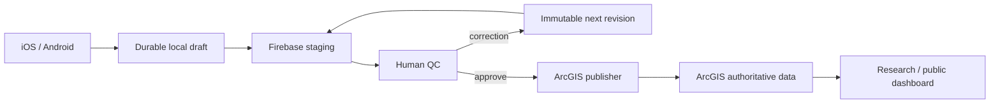

# PA Watershed Watch — Project Roadmap

_Last updated: 2026-08-13_

This roadmap reflects the current native iOS + Android direction, the locked Phase 1–10 scientific/backend foundation, the Spark-compatible mobile checkpoint, and the shortest path to a complete production system.

## North-star lifecycle

The project is not complete when the mobile apps work independently. It is complete when one scientific observation can safely travel through the entire lifecycle:



Automated validation remains part of the architecture, but its live Cloud Functions trigger is not required for the current Spark milestone.

## Phase 12 — Native mobile ↔ Firebase

**Status: substantially complete; final iOS live verification remains.**

Current pushed checkpoint:

`codex/mobile-production-integration-v1` @ `7dbc714ca5a92b32ab159d09e8786fcc86f5bbeb`

### Already proven / integrated

- native SwiftUI and Jetpack Compose frontends preserved
- Firebase Email/Password Auth
- account-scoped durable local storage
- stable submission/event/revision identities
- Firestore site catalog
- real GPS
- canonical supported measurement mapping
- offline submit/retry architecture
- server-backed acknowledgement behavior
- immutable correction revisions
- native/backend CI gates
- Android real authenticated lifecycle including offline/restart/single-sync/correction/account isolation

### Remaining close-out

- independently audit the pushed implementation
- finish equivalent iOS offline/restart/sync/correction live proof
- commit any remaining local readiness evidence
- push final mobile checkpoint

### Current Spark boundary

The current milestone does **not** require:

- Firebase Storage deployment
- cloud photo/audio upload
- Blaze billing
- deployed Firebase Cloud Functions validation trigger

These are deferred infrastructure/features, not blockers to QC, ArcGIS publication, or dashboard work.

## Phase 13 — Minimal QC + trusted review actions

**Status: next implementation.**

For the expected one or two reviewers, build a deliberately small authenticated review surface rather than a Workflow Manager clone.

Minimum routes:

```text
/review
/review/{submissionId}
```

Minimum reviewer actions:

- Approve
- Request Correction
- Reject

The reviewer should see the current scientific revision, measurements, site/map context, collection provenance, notes, validation information when available, and immutable revision history.

Trusted actions should be server-side and narrowly scoped:

```text
POST /api/review/approve
POST /api/review/correction
POST /api/review/reject
```

Each action verifies identity/role/current state/current revision, performs an allowed transition, records a trusted timestamp and reviewer identity, and appends an immutable audit event.

ArcGIS Workflow Manager Online remains optional. Current licensing uncertainty must not block this phase.

## Phase 14 — ArcGIS publishing

**Status: immediately after QC.**

The publisher consumes approved revisions only.

Requirements:

- transform canonical approved revision → ArcGIS schema
- use server-side ArcGIS credentials only
- deterministic publication key
- idempotent write/retry
- verify the ArcGIS feature after write
- store ArcGIS identifiers
- preserve approval if publication fails
- support `PUBLISH_FAILED → PUBLISHING → PUBLISHED`
- protect against duplicate creation when the write succeeds but the response is lost

The mobile apps never publish directly to ArcGIS.

## Phase 15 — Dashboard connection

**Status: required after publication.**

The research/public dashboard reads approved ArcGIS data only.

Minimum useful v1:

- watershed/site map
- site selection
- latest approved observation
- parameter summaries
- historical trends
- date filtering
- appropriate quality/provenance context

Do not expose raw Firebase staging records in the public/research dashboard.

## Phase 16 — End-to-end lifecycle proof

Before expanding scope, prove this chain under failure:

1. Collect offline on a phone.
2. Kill/restart the app.
3. Draft survives.
4. Submit offline.
5. Reconnect.
6. Exactly one logical Firestore submission is acknowledged.
7. Reviewer requests a correction.
8. Collector creates Revision 2; Revision 1 remains immutable.
9. Reviewer approves Revision 2.
10. Publisher writes exactly one ArcGIS observation.
11. ArcGIS publication is verified.
12. Dashboard displays only the approved observation.

This is the primary system acceptance gate.

## Phase 17 — Field pilot

Use TestFlight + Google Play Internal Testing.

Start with approximately 3–10 researchers, one or two reviewers, and a small set of known sampling sites.

Deliberately test poor connectivity, process death, phone restart, permission denial, GPS anomalies, repeated submit taps, corrections, account switching, app upgrades with saved drafts, and ArcGIS publication interruption.

## Phase 18 — Production hardening + v1.0

Only after the vertical lifecycle is working, add the remaining hardening deliberately:

- Development / Pilot / Production environment separation
- schema/app/validation-rule compatibility
- site-catalog versioning
- deterministic duplicate fingerprints
- device-clock sanity checks
- privacy-safe diagnostics
- operational monitoring
- App Check strategy
- explicit multi-device draft policy
- cloud attachment decision
- SHA-256/checksums if attachments remain

## Scientific provenance requirements

Regardless of phase, preserve where applicable:

- original entered value/unit
- normalized value
- method/instrument
- collector UID
- app/schema versions
- collection time
- GPS + accuracy
- creation/submission/review/publication timestamps
- revision ancestry

Never silently overwrite the original submitted scientific record.

## Three product surfaces

| Surface | Data source | Purpose |
| --- | --- | --- |
| Collector mobile | local store + Firebase staging | own field drafts/submissions/corrections |
| Minimal reviewer interface | Firebase staging through trusted review logic | human QC and corrections |
| Research/public dashboard | ArcGIS approved data | maps, trends, exports, analytics |

## Intentionally deferred / excluded from the core path

Keep the field product simple until the lifecycle is proven:

- Firebase Storage / cloud media for the current milestone
- deployed Firebase Cloud Functions trigger while remaining on Spark
- chat
- AI-generated scientific conclusions
- automatic rejection of anomalous environmental values
- direct mobile → ArcGIS publication
- public dashboard → Firebase staging reads
- broad/background location tracking
- social/community functionality
- elaborate analytics inside the collector app
- Bluetooth instrument integration

## Immediate next action

Follow [`NEXT_MOVES.md`](NEXT_MOVES.md): audit the mobile checkpoint, finish the remaining iOS proof, then move immediately into the minimal QC → ArcGIS publisher → dashboard vertical slice.
