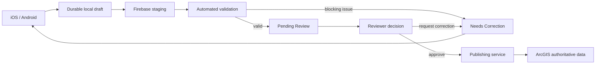

# PA Watershed Watch — Project Roadmap

_Last updated: 2026-08-13_

This roadmap reflects the current native iOS + Android direction, the locked Phase 1–10 backend contracts, and the decision to keep the product focused. It intentionally separates what must ship from what can wait.

## Current objective

Finish the production mobile integration before adding new product features.

The release-critical proof is one observation traveling safely through the entire lifecycle without duplication or data loss:

## Phase A — Production mobile integration

**Status: in progress via Codex**

Do not redesign either native frontend during this phase.

Required outcomes:

- Native SwiftUI iOS and Jetpack Compose Android remain the approved UX.
- Real Firebase Authentication.
- Account-scoped durable local drafts.
- Stable `submission_id`, `event_id`, `revision_id`, measurement IDs, and attachment IDs.
- Canonical Firestore mappings shared by behavior, not by runtime code.
- Real authenticated site catalog with offline cache.
- Real GPS coordinates and accuracy.
- Explicit `America/New_York` collection-time semantics.
- Real photo/audio attachment files.
- Secure Firebase Storage contract.
- Offline submit intent and durable retry.
- Idempotent writes and server-backed sync confirmation.
- Immutable correction revisions.
- Validation trigger/readback.
- Cross-platform golden fixtures.
- Existing Phase 9/10 tests remain green.
- Debug/release native builds pass.

### Merge gate

Before this branch merges, perform an independent review of:

- SwiftData / Room schema and migrations
- Firestore DTO mapping
- Firebase Auth and account isolation
- retry/idempotency logic
- Storage rules and attachment lifecycle
- App Check configuration
- timestamps and timezone handling
- validation trigger behavior
- revision immutability
- cross-platform serialization parity

A summary saying “tests passed” is not sufficient without inspecting the implementation.

## Phase B — Reliability and scientific provenance hardening

These items should be added after the core production path is proven.

### Environment separation

Create explicit environments:

- Development
- Staging / Pilot
- Production

Each environment must have separate backend configuration and hard safeguards against a development build writing production data. Debug builds should make the active environment visually obvious.

### Schema / app compatibility

Introduce explicit compatibility handling between:

- application version
- schema version
- validation-rule version

Older clients must fail safely when encountering data they cannot interpret rather than corrupting records.

### Scientific provenance

Every submitted revision should retain, where applicable:

- original entered value
- original entered unit/basis
- normalized value
- method
- instrument/lab
- collector UID
- app version
- schema version
- collection time
- GPS coordinate + accuracy
- creation/submission timestamps
- revision ancestry

A later correction must never erase the original observation.

### Duplicate detection

Add a deterministic observation fingerprint used to flag likely accidental duplicates caused by retries or repeated submission actions.

The fingerprint is advisory: never automatically delete scientific records solely because they appear similar.

### Attachment integrity

Calculate SHA-256 for photo/audio attachments before upload.

Use checksums for:

- upload verification
- corruption detection
- retry safety
- provenance
- optional future deduplication

### Trusted time

Collection time remains researcher-entered scientific data.

Audit/workflow timestamps such as `created_at`, `submitted_at`, validation timestamps, review timestamps, and publication timestamps should use trusted server time where the contract permits.

Add device-clock sanity checks so a badly configured phone clock does not contaminate provenance.

### Spatial anomalies

GPS/site-distance warnings remain advisory.

A legitimate observation outside the expected site tolerance must be preserved and flagged for review rather than automatically discarded.

### Site-catalog versioning

Drafts must preserve the exact site definition/version used when the field observation was created.

A later cache refresh must not silently mutate historic science if the site's name, reference coordinate, tolerance, or active state changes.

### Multi-device policy

Local drafts are device-specific by default.

Submitted records/revisions are server identities.

Do not silently merge an unfinished iPhone draft with an Android draft. Cross-device draft continuation can be designed later if there is a real need.

### Field diagnostics

Add a privacy-safe Account → Diagnostics screen showing operational information only:

- app/build version
- schema version
- active environment
- truncated/safe authenticated UID
- site-catalog refresh time/source
- pending submission count
- pending attachment count
- last sync attempt/result
- backend reachability

Do not include measurement values, notes, coordinates, credentials, or private site details in diagnostic output.

## Phase C — Minimal human QC + publication

### Review workflow strategy

ArcGIS Workflow Manager Online is **optional**, not a release dependency.

Current licensing uncertainty must not block the project.

For one or two reviewers, prefer a very small authenticated review page rather than a large operations console.

The review interface should only need:

- pending review queue
- observation/revision detail
- validation flags/quality information
- notes/media/map context
- immutable revision history
- **Approve**
- **Request Correction**
- **Reject**

Firebase remains the staging/workflow source of truth.

The reviewer UI must invoke trusted server actions rather than directly mutating arbitrary workflow fields.

### Publishing service

Treat publishing as a first-class backend component.

Only approved records may publish.

Requirements:

- transform canonical approved revision → ArcGIS schema
- deterministic publication/idempotency key
- write once
- verify the ArcGIS response
- record ArcGIS identifiers
- safe retry for `PUBLISH_FAILED`
- protect against the “write succeeded but response was lost” duplicate scenario

Mobile apps never contain ArcGIS publishing credentials and never publish directly.

### Immutable audit events

Every meaningful workflow transition should record:

- actor
- trusted timestamp
- prior state
- new state
- submission ID
- revision ID
- action context/reason

Audit data is append-only from trusted server logic.

## Phase D — Pilot

Do not jump from simulators/emulators directly to public release.

Use:

- TestFlight
- Google Play Internal Testing

Start with roughly 3–10 real researchers and a small set of known sampling sites.

Deliberately test:

- poor/no cellular connectivity
- process termination
- phone restart
- permission denial
- GPS quality problems
- long observations
- attachment failures
- corrections
- device/account switching
- app upgrade with saved drafts

### End-to-end pilot acceptance test

A release candidate should prove:

1. Researcher completes an observation with no signal.
2. App is terminated/restarted.
3. Every field value and ID survives.
4. Connectivity returns.
5. Exactly one logical submission reaches Firebase.
6. Automated validation runs.
7. Reviewer requests a correction.
8. Collector creates Revision 2; Revision 1 stays immutable.
9. Reviewer approves Revision 2.
10. Publishing service writes exactly one authoritative ArcGIS observation.
11. ArcGIS publication is verified.
12. Dashboard reads only the approved ArcGIS record.

## Three product surfaces

Keep the system boundaries explicit:

| Surface | Data source | Purpose |
| --- | --- | --- |
| Collector mobile | local store + Firebase staging | own field drafts/submissions/corrections |
| Reviewer interface | Firebase staging | validation/QC/reviewer actions |
| Research/public dashboard | ArcGIS approved data | maps, trends, exports, analytics |

The public dashboard must not read raw staging submissions.

## Intentionally deferred

Keep the field product simple. Do **not** add these before the basic pipeline is proven:

- chat
- AI-generated scientific conclusions
- automatic rejection of anomalous environmental values
- direct mobile → ArcGIS publication
- public dashboard → Firebase staging reads
- broad/background location tracking
- social/community functionality
- elaborate analytics inside the collector app
- Bluetooth instrument integration

## Optional later enhancements

Only consider these after pilot feedback proves a need:

- sample bottle / QR / barcode scanning
- instrument catalog and calibration history
- laboratory chain-of-custody workflow
- structured weather/field-condition metadata
- sanitized support-package export
- debug-build failure injection tools
- public/shared observations in the mobile app sourced from approved ArcGIS data
