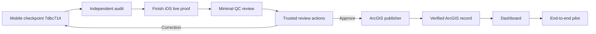

# PA Watershed Watch — Project Status

_Last updated: 2026-08-13_

This page is the quick operational snapshot for the repository. Detailed design and evidence remain in the phase/audit documents.

## Executive status

| Domain | Status | Notes |
| --- | --- | --- |
| Platform architecture | ✅ Complete | boundaries, provenance, revision semantics established |
| Phase 1–10 contracts | ✅ Stable baseline | scientific/config/security authority remains preserved |
| ArcGIS schema / staging | ✅ Available | authoritative publication remains downstream |
| Firebase Auth / Firestore | ✅ Spark-compatible integration | real native clients now wired to the development project |
| Android native production path | ✅ Live verified | auth, session, site catalog, GPS, draft restart, offline submit/restart, exactly-one sync, server acknowledgement, recent/detail, correction, account isolation |
| iOS native production path | 🟡 Code integrated / final live proof pending | real Auth, session restoration, and server site catalog passed before Codex usage limit interrupted the remaining live verification |
| Active mobile checkpoint | ✅ Pushed | `codex/mobile-production-integration-v1` @ `7dbc714ca5a92b32ab159d09e8786fcc86f5bbeb` |
| Automated validation engine | ✅ Baseline implemented/tested | live Cloud Functions trigger deployment intentionally deferred while remaining on Spark |
| Cloud photo/audio upload | ⏸ Deferred | Firebase Storage/Blaze not required for current milestone; may be removed from v1 |
| Minimal QC reviewer page | ▶️ Next implementation | deliberately small, expected 1–2 reviewer use case |
| Trusted reviewer actions | ▶️ Next implementation | approve / request correction / reject with audit-safe transitions |
| ArcGIS publishing service | ▶️ Immediately after QC | approved revision → idempotent verified ArcGIS write |
| Research/public dashboard | ▶️ Immediately after publishing | approved ArcGIS data only |
| End-to-end lifecycle test | 🧭 Planned | phone → Firebase → QC → ArcGIS → dashboard |
| Field pilot | 🧭 Planned | TestFlight + Play Internal Testing |

## Current handoff

The current active engineering branch is safely pushed to GitHub:

```text
codex/mobile-production-integration-v1
└── 7dbc714  fix(firestore): allow stable-id sync preflight
    └── 5fe0e3e  ci(mobile): add native and backend production gates
        └── 995dc6b  production mobile integration checkpoint
```

Do not reset or replace this branch. The local Mac working tree may contain additional uncommitted iOS verification/readiness artifacts produced after `7dbc714`; preserve them until Codex can resume.

## Active branch model

| Branch | Meaning |
| --- | --- |
| `main` | Phase 1–10 stable baseline |
| `codex/android-native-v1` | completed native Android frontend checkpoint |
| `codex/mobile-production-integration-v1` | current native production integration authority |
| `docs/project-roadmap-2026-08-13` | current roadmap/architecture/documentation coordination |
| `sync/phase11-local-2026-08-13` | recovery snapshot |
| `archive/*` | historical only |

The old Expo/React Native `mobile/` tree is engineering reference, not the current product architecture.

## Spark decision

The current milestone remains on Firebase Spark.

**Still required now:**

- Firebase Email/Password Auth
- Firestore site catalog and staging submissions
- durable local storage
- offline/restart-safe synchronization
- stable IDs and exactly-once logical submission behavior
- correction revisions
- minimal QC review
- ArcGIS publication
- dashboard connection

**Deferred, not required for the current milestone:**

- Firebase Storage deployment / cloud media upload
- Blaze billing
- deployed Firebase Cloud Functions validation trigger
- automatic live validation state transitions

The QC reviewer flow, ArcGIS publishing, and dashboard are **not deferred**. They will use a lightweight trusted web/server layer rather than making Blaze a prerequisite.

## Immediate execution path



## What must be audited now

Before calling mobile production-ready, inspect the pushed implementation rather than relying only on the Codex summary:

- Swift local persistence and migrations
- Room persistence and migrations
- Firebase Auth/session restoration
- account isolation
- Firestore DTO mappings
- stable IDs and preflight/idempotency behavior
- server-backed acknowledgement semantics
- offline submit + restart recovery
- `America/New_York` collection-time behavior
- immutable revision/correction behavior
- cross-platform golden serialization fixtures
- debug/release build gates
- any remaining local-only iOS verification changes before they are committed

## Next implementation boundary

The next product should **not** be a large operations console. Build one lightweight web layer containing only the capabilities needed to close the scientific lifecycle:

```text
/review
/review/{submissionId}
/api/review/approve
/api/review/correction
/api/review/reject
/api/publish
/dashboard
```

The reviewer experience is intentionally small. Firebase remains private staging state. ArcGIS becomes authoritative only after approval and verified publication. The dashboard reads approved ArcGIS data, never raw Firebase staging.

See [`NEXT_MOVES.md`](NEXT_MOVES.md), [`PROJECT_ROADMAP.md`](PROJECT_ROADMAP.md), and [`SYSTEM_FLOW_AND_FAILURES.md`](SYSTEM_FLOW_AND_FAILURES.md).
