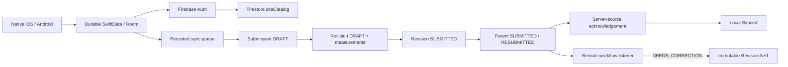
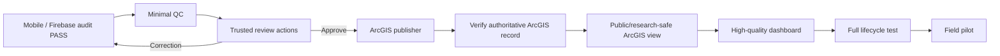

# PA Watershed Watch — Project Status

_Last updated: 2026-08-13_

This page is the quick operational snapshot for the repository. Detailed evidence remains in the audit and phase documents.

## Executive status

| Domain | Status | Notes |
| --- | --- | --- |
| Platform architecture | ✅ Complete | boundaries, provenance, revision semantics established |
| Phase 1–10 contracts | ✅ Stable baseline | scientific/config/security authority preserved |
| Firebase Auth / Firestore | ✅ Ready upstream contract | real native clients wired to `central-pa-watershed-dev` |
| Android native production path | ✅ Live verified | auth, session, site catalog, GPS, restart, offline submit, single sync, acknowledgement, correction, isolation |
| iOS native production path | ✅ Accepted for forward integration | equivalent production code/tests; remaining live proof explicitly accepted as non-blocking |
| Active mobile checkpoint | ✅ Pushed + independently audited | `codex/mobile-production-integration-v1` @ `7dbc714ca5a92b32ab159d09e8786fcc86f5bbeb` |
| Mobile independent audit | ✅ PASS to begin QC | see `MOBILE_INDEPENDENT_AUDIT_7DBC714.md` |
| Automated validation engine | ✅ Baseline implemented/tested | live Functions trigger deployment deferred on Spark |
| Cloud photo/audio | ⏸ Deferred | current Spark build must feature-gate/hide media before field deployment |
| Minimal QC reviewer page | ▶️ ACTIVE NEXT PHASE | scientific, focused, 1–2 reviewer use case |
| Trusted reviewer actions | ▶️ ACTIVE NEXT PHASE | Approve / Request Correction / Reject + immutable audit |
| ArcGIS schema / private staging | ✅ Existing concrete target | Phase 7 item + fixed layer/table IDs + verification scripts |
| Authoritative ArcGIS publication | ▶️ After QC action contract | approved revision → idempotent verified ArcGIS record |
| Research/public dashboard | ▶️ After authoritative ArcGIS path | approved/public-safe ArcGIS views only |
| Full lifecycle test | 🧭 Planned | collect → sync → inspect → correct → approve → publish → visualize |
| Field pilot | 🧭 Planned | TestFlight + Play Internal Testing |

## Current handoff

```text
codex/mobile-production-integration-v1
└── 7dbc714  fix(firestore): allow stable-id sync preflight
    └── 5fe0e3e  ci(mobile): add native and backend production gates
        └── 995dc6b  production mobile integration checkpoint
```

This branch is now the accepted mobile/Firebase upstream contract for the next phase. Do not restart or redesign the native applications unless the QC/publishing integration exposes a concrete defect.

## What the mobile/Firebase layer now does



The Firestore security boundary independently enforces collector ownership and submitted-revision immutability. Reviewers do not receive arbitrary client-side approval authority; trusted review writes are the responsibility of the next server/web layer.

## Three mobile closeout items carried in parallel

These do not justify another mobile redesign, but they must be resolved at the appropriate gate:

1. **Before field use:** disable/hide cloud media on the Spark build so adding a photo/audio file cannot make submission sync fail.
2. **Before QC/publication is called production-ready:** persist original entered value + entered unit/basis for every supported non-temperature measurement alongside the canonical value.
3. **Before QC/publication is called production-ready:** separate researcher collection time from trusted server receipt/workflow timestamps; reviewer/audit/publication timestamps must be server-authored.

See `MOBILE_INDEPENDENT_AUDIT_7DBC714.md` for evidence and rationale.

## Existing ArcGIS foundation

The repository already records:

- local ArcGIS Pro environment: `MyProject.aprx` + `CentralPA_Watershed.gdb` (documented local environment; `.aprx` binary not Git-tracked);
- private ArcGIS Online item `b7775c1bdada4aa8b0787714eca3eb15` (`Central_PA_Watershed_QC_Staging`);
- `SamplingSites` service ID `10`;
- `SamplingEvents` service ID `20`;
- `Measurements` service ID `30`;
- `ValidationFlags` service ID `40`;
- `AuditEvents` service ID `50`;
- WGS84, GlobalID/GUID relationship expectations, Eastern presentation time, and read-only verification scripts.

The existing Phase 7 online item is explicitly a **private QC staging service**, not the final authoritative/public service. The publishing/dashboard phase must create or designate the authoritative approved-data destination and public/research-safe view(s) deliberately.

## Active execution path



## Active branch model

| Branch | Meaning |
| --- | --- |
| `main` | Phase 1–10 stable baseline |
| `codex/android-native-v1` | completed native Android frontend checkpoint |
| `codex/mobile-production-integration-v1` | accepted mobile production/Firebase authority |
| `docs/project-roadmap-2026-08-13` | current architecture/audit/coordination |
| `sync/phase11-local-2026-08-13` | recovery snapshot |
| `archive/*` | historical only |

Recommended next implementation branch: `codex/web-qc-publishing-dashboard-v1`.

See [`MOBILE_INDEPENDENT_AUDIT_7DBC714.md`](MOBILE_INDEPENDENT_AUDIT_7DBC714.md), [`NEXT_MOVES.md`](NEXT_MOVES.md), [`REVIEW_AND_PUBLISHING_STRATEGY.md`](REVIEW_AND_PUBLISHING_STRATEGY.md), and [`SYSTEM_FLOW_AND_FAILURES.md`](SYSTEM_FLOW_AND_FAILURES.md).