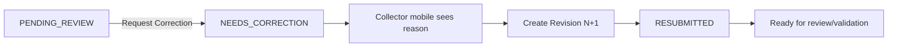

# PA Watershed Watch — Review and Publishing Strategy

_Last updated: 2026-08-13_

## Decision

ArcGIS Workflow Manager Online is not a hard project dependency.

For the expected reviewer population of one or two people, the preferred path is a **minimal authenticated QC review page** plus narrowly scoped trusted review actions. Workflow Manager may be integrated later if licensing becomes available and provides real value.

The project currently remains on Firebase Spark. That does **not** defer QC, ArcGIS publishing, or the dashboard. Those capabilities can be implemented in the trusted web/server layer without requiring Firebase Cloud Functions or Firebase Storage.

## Responsibility split

| Component | Responsibility |
| --- | --- |
| Native collector apps | field collection, durable drafts, GPS, measurements, submit/resubmit |
| Firebase Auth + Firestore | identity, private staging records, revision history, workflow/readback state |
| Validation engine | existing scientific/structural validation logic; live trigger automation can be enabled later |
| Minimal QC page | human review experience only |
| Trusted review API | role/state checks, approve/correct/reject transitions, immutable audit events |
| Publishing logic | transform, verify, idempotently publish approved revision |
| ArcGIS | authoritative approved observations and sites |
| Dashboard | approved maps, trends, exports, analytics |

## Minimal QC page

Suggested routes:

```text
/review
/review/{submissionId}
/review/history   optional
```

The observation detail should include only what is needed for defensible scientific review:

- site and map/GPS context
- collection date/time
- collector
- method/instrument or lab provenance
- entered measurements and units
- validation information when available
- notes
- revision history

Primary actions:

- **Approve**
- **Request Correction**
- **Reject**

Do not add task boards, chat, project-management features, elaborate assignment systems, or analytics to the reviewer UI unless pilot feedback proves a need.

## Trusted review actions

The browser must not have permission to arbitrarily rewrite workflow fields.

Preferred endpoints:

```text
POST /api/review/approve
POST /api/review/correction
POST /api/review/reject
```

Each action should:

1. verify the authenticated identity;
2. verify reviewer/admin authorization;
3. load the current submission and revision;
4. verify the requested transition is valid;
5. verify the reviewed revision is still current;
6. apply the transition atomically;
7. record reviewer identity and trusted timestamp;
8. record decision/comment/reason;
9. append an immutable audit event;
10. return the committed state.

This makes repeated clicks, stale browser tabs, and replayed requests safe.

## Correction loop



The previous revision is never overwritten.

## Approval / publication loop


The reviewer browser and mobile clients never receive ArcGIS publishing credentials.

## Publishing idempotency

Define a deterministic publication key tied to the approved scientific identity, using the stable submission and approved revision identities.

Before creating a new ArcGIS observation, the publisher must determine whether that publication key is already represented in ArcGIS.

This protects against the critical failure mode where ArcGIS successfully creates the feature but the response is lost and the publisher retries.

## Publish failure behavior

A publication failure must not erase approval.

Expected state path:

`APPROVED → PUBLISHING → PUBLISH_FAILED → PUBLISHING → PUBLISHED`

Retries reuse the same publication identity and verify existing ArcGIS state before creating anything new.

## Spark-compatible execution model

Firebase Spark remains sufficient for the current client/staging layer:

```text
Native apps
   ↓
Firebase Auth + Firestore
   ↓
Minimal trusted web/server layer
   ├── review actions
   └── ArcGIS publisher
   ↓
ArcGIS
```

Firebase Storage and deployed Firebase Cloud Functions are optional future infrastructure for this project, not prerequisites for the review/publication lifecycle.

The exact hosting provider/runtime for the trusted web layer should be chosen based on the existing website stack, secure server-side secret support, deployment simplicity, and minimal operational burden. Do not introduce multiple services if the existing web deployment can safely host the review and publication endpoints.

## Dashboard boundary

After verified publication, the public/research dashboard reads ArcGIS approved data only.

```text
Firebase staging  -- private, unapproved
        ↓ review/publish
ArcGIS             -- authoritative, approved
        ↓
Dashboard          -- research/public visualization
```

Do not make the dashboard read Firestore staging as a shortcut.

## Workflow Manager future adapter

If Penn State later licenses Workflow Manager Online, treat it as an optional workflow provider rather than the canonical scientific database.

Conceptually:

```text
ReviewWorkflowProvider
├── WatershedTrustedReviewProvider
└── ArcGISWorkflowManagerProvider   optional later
```

The scientific record, immutable revisions, and publication identity remain owned by the Watershed platform contracts.

## ArcGIS-only fallback

If even the minimal QC page proves disproportionately costly, a private ArcGIS review layer/table may be evaluated as a fallback UI surface.

Any fallback must still preserve trusted synchronization, immutable revisions, privacy boundaries, idempotent publication, and no direct mobile publication.
