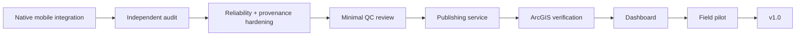

# Development Roadmap

> This file is retained as a stable entry point. The authoritative current roadmap is [`PROJECT_ROADMAP.md`](PROJECT_ROADMAP.md).

## Project progress

| Phase | Milestone | Status |
| --- | --- | --- |
| 1 | Architecture + mind map | ✅ Complete |
| 2 | GitHub repository foundation | ✅ Complete |
| 3 | Documentation / changelog / project foundation | ✅ Complete |
| 4 | Formal data dictionary | ✅ Complete |
| 5 | ArcGIS Pro geodatabase prototype | ✅ Complete |
| 6 | ArcGIS domains + relationships + IDs | ✅ Complete |
| 7 | Clean ArcGIS Online staging environment | ✅ Complete |
| 8 | Human-review workflow design | ✅ Design complete; Workflow Manager Online now optional |
| 9 | Firebase schema + security foundation | ✅ Complete |
| 10 | Automated validation engine | ✅ Complete |
| 11 | Native iOS + Android collector | 🚧 Production integration in progress |
| 12 | Minimal reviewer/QC workflow | 🧭 Next after mobile integration |
| 13 | Verified ArcGIS publishing service | 🧭 Next after reviewer path |
| 14 | Research/public dashboard | 🧭 Planned |
| 15 | End-to-end pilot and failure testing | 🧭 Planned |
| 16 | v1.0 production release | 🧭 Planned |

## Current implementation sequence

The detailed requirements, merge gates, future improvements, and intentionally deferred features live in [`PROJECT_ROADMAP.md`](PROJECT_ROADMAP.md).
