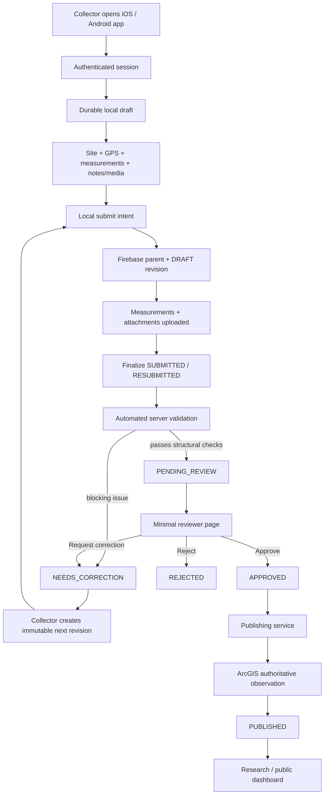
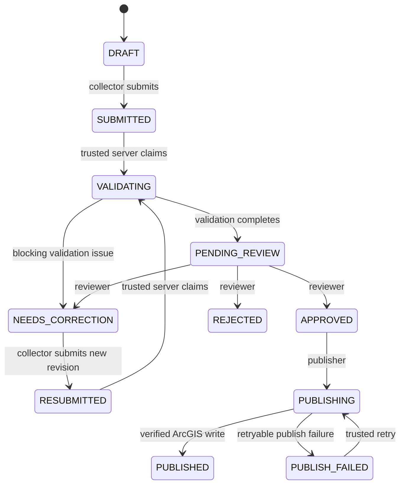
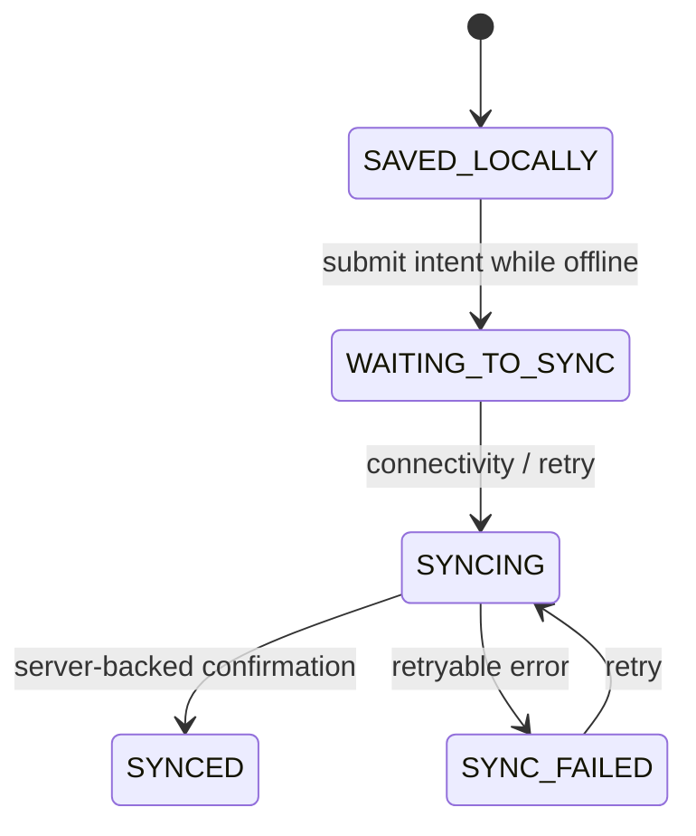
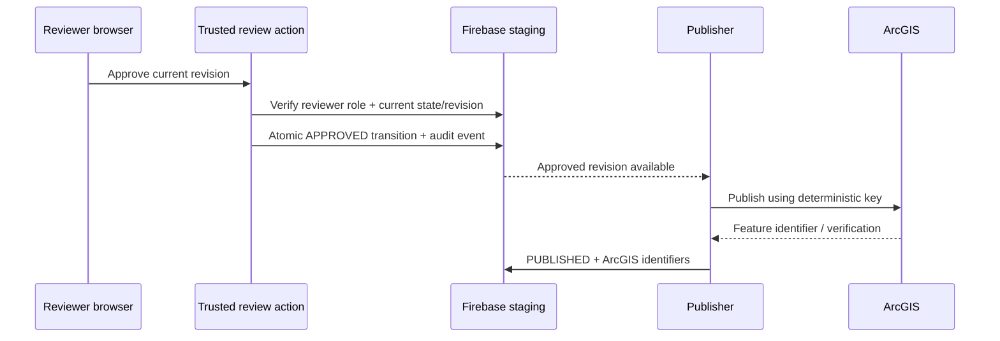

# PA Watershed Watch — End-to-End System and Failure Paths

_Last updated: 2026-08-13_

This document defines the intended happy path and what must happen when any node fails. The goal is a seamless user experience without sacrificing scientific provenance, retry safety, or auditability.

## Happy path

## Two independent state dimensions

### Scientific / workflow state

### Local transport state

Never collapse workflow and transport into one status field.

## Boundary rule

Every important boundary must have:

1. durable local or server state;
2. stable identity / idempotency key;
3. explicit acknowledgement;
4. retry behavior;
5. a way to distinguish “not yet confirmed” from “failed.”

## Failure matrix

| Node | Example failure | Required behavior |
| --- | --- | --- |
| Local draft | app/process killed | recover exact draft and stable IDs from durable storage |
| Authentication | session expired | preserve owned draft, require re-authentication, never reassign owner UID |
| Site catalog | network unavailable | use authenticated cached catalog and expose source/staleness |
| GPS | denied/unavailable/poor | show state, allow reacquire, preserve science; never fabricate coordinates |
| Numeric entry | malformed value | retain input, show field error, never coerce blank to zero |
| Photo/audio capture | local file operation fails | preserve draft; surface attachment failure separately |
| Media upload | Storage unavailable | keep durable local file + upload state and retry later |
| Firestore preparation | network fails | keep same IDs and local submit intent; retry the same remote draft |
| Submit action | rapid double tap | create one logical submission/revision only |
| App restart during sync | process death | resume from durable sync state, not UI memory |
| Validation trigger | service unavailable | preserve submission; trusted backend retries; client does not fake validation |
| Validation | unusual value | flag for review; do not discard merely for being unusual |
| Review page | reviewer loses network | do not show decision as committed until trusted server action confirms |
| Review action | double-click / stale tab | trusted idempotent action validates current revision/state first |
| Correction | collector offline | new correction revision remains local until safely resubmitted |
| Publishing | ArcGIS unavailable | move to `PUBLISH_FAILED`; preserve approval and retry safely |
| Publishing | ArcGIS write succeeds but response is lost | query by stable publication key, verify existing feature, do not duplicate |
| Dashboard | publication delayed | show last authoritative ArcGIS data; never substitute staging data |

## Identity strategy

The system should preserve separate stable identities:

- `submission_id` — staging/workflow envelope
- `event_id` — stable scientific event identity across correction revisions
- `revision_id` — immutable scientific snapshot
- `measurement_id` — measurement document identity within a revision
- `attachment_id` — attachment identity within a revision
- `site_id` — sampling-site identity
- `publication_key` — deterministic publishing/idempotency key for an approved revision

Retries reuse identities rather than creating replacement records.

## New observation remote sequence

Because measurements and attachment metadata may only be modified while the revision is `DRAFT`, the client sync process should use this order:

1. Complete scientific snapshot exists locally.
2. Persist local submit intent.
3. Create/update parent submission as `DRAFT`.
4. Create current revision as `DRAFT`.
5. Write canonical measurements.
6. Upload binary attachments.
7. Write attachment metadata.
8. Verify remote pieces are present.
9. Finalize revision to submitted state.
10. Transition parent to `SUBMITTED`.
11. Wait for server-backed acknowledgement.
12. Keep enough local state to recover until acknowledgement is proven.

## Correction sequence

1. Server marks parent `NEEDS_CORRECTION` with reason/context.
2. Collector opens the record.
3. Client preserves the previous submitted revision untouched.
4. Client creates a new local revision with a new `revision_id` and incremented revision number.
5. Collector edits only the new revision.
6. Client syncs the new DRAFT revision and its measurements/attachments.
7. Parent moves to `RESUBMITTED` only after the new revision is ready.
8. Validation runs again.
9. Revision history always contains the original scientific snapshot.

## Review sequence

The reviewer interface should not directly mutate arbitrary Firestore workflow fields.

Preferred pattern:

The same trusted-action pattern applies to Request Correction and Reject.

## Privacy boundaries

- Collector mobile reads/writes only the authenticated collector's staging data.
- Reviewer access is role-controlled.
- Validation/audit/publication fields are trusted-server owned.
- Public/research dashboards read approved ArcGIS data, not Firebase staging.
- Mobile apps never contain ArcGIS publishing credentials.
- Diagnostics must exclude scientific values, GPS coordinates, notes, credentials, and private site metadata.
